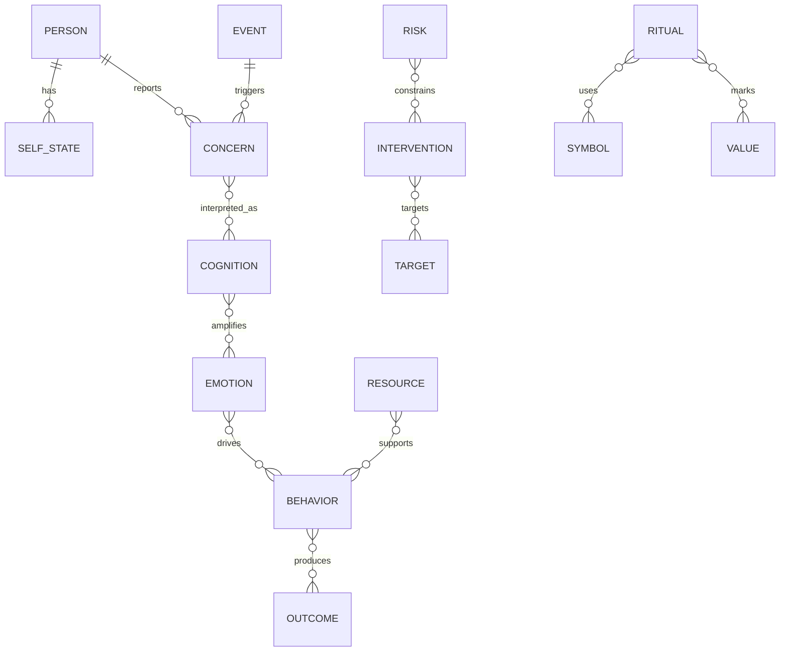
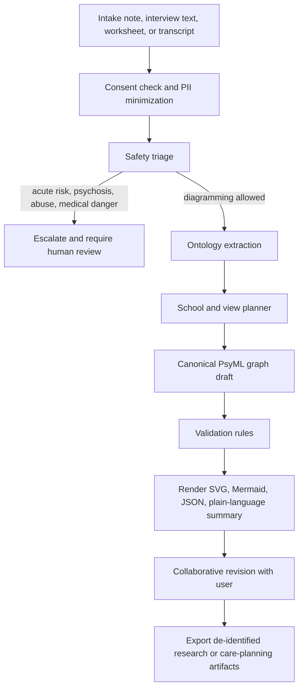
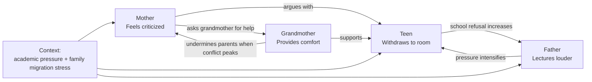
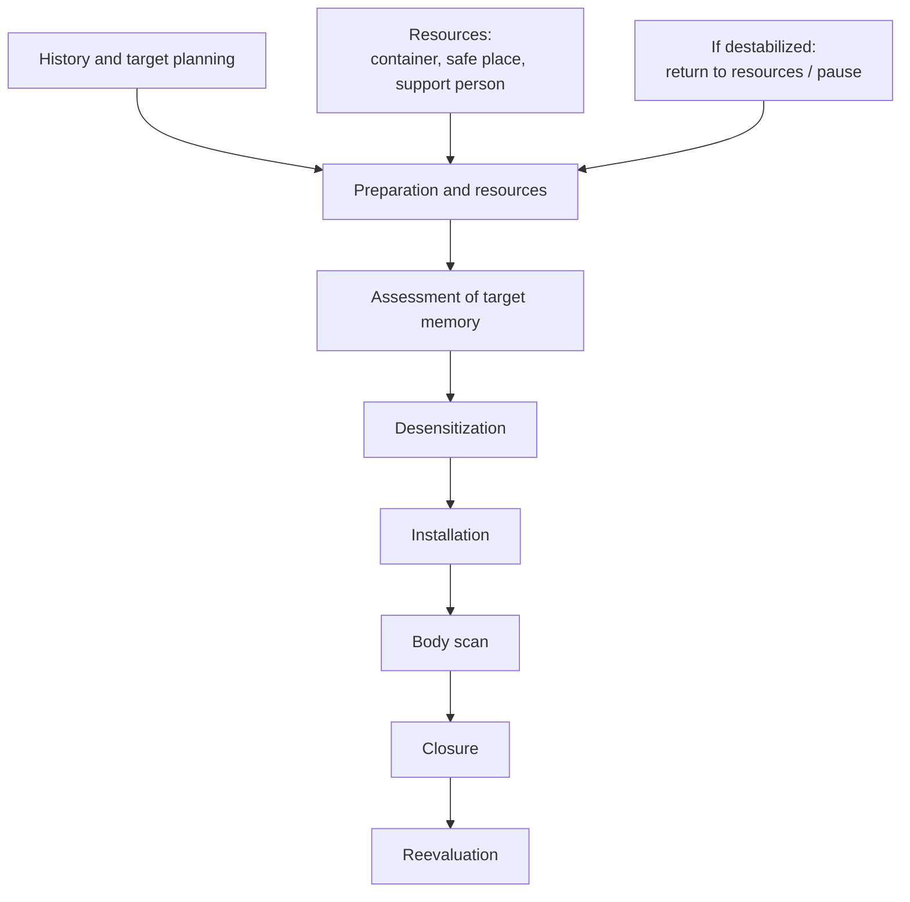

# Comprehensive Specification for a Fable Agent to Build PsyML

> **Editorial note (added on save, not part of the source).** This is a second
> user-provided companion research document ("PsyML"), saved verbatim for reference
> alongside the primary PsyUML specification (`../specification/psyuml-v0.1.0.md`) and
> the first companion paper (`upml-fable-agent-architecture.ru.md`). It is notably
> well-grounded and ethically careful, and converges with PsyUML's architecture
> (one canonical graph + multiple views). The inline `cite…turn…` tokens are citation
> artifacts from the source's research tooling and carry no repo meaning. Which of its
> ideas are folded into the PsyUML implementation is recorded in
> [`idea-incorporation.md`](./idea-incorporation.md) §5. "PsyML" here is a parallel
> name for the same endeavor; the project keeps the name **PsyUML**.

## Executive summary

The best way to design a “UML for psychotherapy” is **not** to force all psychotherapy knowledge into one universal diagram. The research base points instead to a **multi-view language**: one canonical ontology with several diagram types, analogous to how UML uses multiple diagram families for different questions, BPMN emphasizes stakeholder-readable process flow, and SysML adds precision, interoperability, and extensibility. In psychotherapy, the closest direct precedents are not UML itself but **CAT sequential diagrammatic reformulation**, **CBT vicious circles and five-part formulations**, **genograms/ecomaps**, **ACT Matrix**, **DBT chain analysis**, **EMDR phase structures**, **narrative maps**, **body mapping**, and **symptom-network models**. A rigorous specification should borrow from all of them rather than choose a single school’s worldview. citeturn39search0turn38search1turn29search0turn20search1turn20search3turn16search0turn16search1turn31search1turn32search2turn16search19turn16search2turn42search0turn34search0

This report therefore proposes a concrete visual language, provisionally named **PsyML**, built around a **typed graph plus view system**. The canonical graph stores entities such as people, self-states, symptoms, thoughts, emotions, sensations, behaviors, relationships, values, resources, interventions, risks, and rituals. Views render that graph as a **Loop Map**, **System Map**, **Self-State Map**, **Journey Map**, **Body Map**, or **Ritual Map**. Each node and edge carries explicit tags for whether it is **reported, observed, inferred, planned, or symbolic**, because case formulation is a working hypothesis rather than settled fact. That collaborative and revisable stance is consistent with contemporary case conceptualization literature and with CAT’s co-created maps. citeturn21search0turn21search14turn15search15turn20search3turn20search12

The specification also treats **ritual and magical practices** as first-class but tightly bounded elements. The system should represent ritual acts, sacred objects, symbols, transitions, witnesses, intentions, and tradition-specific correspondences **without treating supernatural claims as system-verified facts**. The empirical literature supports rituals as regulators of anxiety, control, grief, and symbolic meaning, and family/spiritual assessment literature already offers tools such as spiritual ecomaps and spiritual genograms. At the same time, ethical practice requires cultural respect, role clarity, and safeguards against coercion, compulsive escalation, or delusion reinforcement. citeturn7search0turn7search4turn7search5turn32search2turn32search7turn8search0turn8search1turn33search0turn33search4

For implementation, a Fable-hosted agent should function as **decision-support and diagram-support**, not as an autonomous therapist. The agent should ingest narrative material, scrub or segment sensitive data, perform safety triage, extract ontology elements, choose one or more views, generate draft diagrams, ask clarification questions, validate for privacy and clinical hazards, and export to SVG, Mermaid, JSON, and—where appropriate—health data standards such as FHIR Observation, Questionnaire, QuestionnaireResponse, and CarePlan. This design aligns with official privacy, ethics, clinical-risk, and AI-governance sources from APA, HHS HIPAA, GDPR, WHO, FDA, NHS clinical safety standards, and HL7 FHIR. citeturn9search0turn9search1turn9search2turn22search1turn22search2turn22search4turn23search0turn23search5turn12search0turn13view1turn13view2turn14search0turn14search4

## Research basis and design criteria

The strongest argument for a psychotherapy visual language is not aesthetic; it is cognitive and clinical. Classic work on diagrammatic reasoning shows that diagrams can make certain inferences easier when information is spatially organized for the task at hand, while the cognitive-dimensions literature and later notation-design work argue that new notations should be designed explicitly for usability rather than treated as neutral containers. In parallel, concept-mapping research shows the value of labeled relations, hierarchy, and cross-links, and recent psychotherapy literature emphasizes that case conceptualization should be individualized, collaborative, explanatory, and revisable over time. citeturn28search11turn28search2turn28search14turn28search5turn30search1turn21search0turn21search14turn15search15

A good psychotherapy notation therefore needs to answer at least six distinct question types: **What is happening now?** **What maintains it?** **Who else is involved?** **What matters to the person?** **What is the current plan?** **What meanings, rituals, or symbols shape the work?** Existing psychotherapy diagrams answer only subsets of those questions. CAT maps repeating patterns; CBT maps maintenance cycles; genograms map family structure; ecomaps map ecological supports and strains; EMDR and trauma-focused methods map staged treatment and targets; somatic methods foreground bodily sensations; and ritual/spiritual tools map symbolic ecosystems. The specification below treats these as complementary views over one graph rather than competing notations. citeturn20search3turn16search0turn31search1turn32search2turn42search0turn18search25turn36search1turn32search7

The user personas and core requirements follow directly from that evidence base:

| Persona | Primary need | What the notation must optimize | Key evidence |
|---|---|---|---|
| **Therapists** | Case formulation, supervision, handoff, treatment planning | Precision, revisability, cross-school translation, risk flags, exportability | Collaborative case conceptualization and CAT reformulation stress shared working models that guide intervention. citeturn21search14turn21search0turn20search1turn20search3 |
| **Clients** | Understanding their own patterns and options | Simplicity, plain language, emotional safety, editable ownership, client-safe views | Visual psychotherapy and CBT teaching materials emphasize engagement, understanding, and retention; person-centered work emphasizes empathy and client subjectivity. citeturn19search5turn19search8turn16search0turn6search0turn6search1 |
| **Researchers** | Coding formulations, comparing schools, studying mechanisms | Schema stability, provenance, de-identification, quantifiable attributes | Symptom-network and personalized-network research depends on explicit nodes, edges, and comparable structures. citeturn34search0turn34search7turn34search14 |
| **Ritual practitioners** | Mapping intentions, symbols, sequences, transitions, witnesses | Symbolic layer, tradition tags, role boundaries, safety constraints | Spiritual ecomaps/genograms and ritual psychology support diagrammatic representation of spiritual ecosystems and ritual functions. citeturn32search2turn32search7turn7search4turn7search5 |

The core requirements and nonfunctional constraints can be specified as follows:

| Area | Requirement | Concrete implication for PsyML | Basis |
|---|---|---|---|
| **Usability** | Human-readable first; machine-readable second | Limit the primitive set, use consistent shapes, labeled edges, progressive disclosure, and client-safe summaries | BPMN explicitly aims to be directly usable by stakeholders while remaining precise; concept maps and notation research support readable labels and limited symbol overload. citeturn38search1turn30search1turn28search5 |
| **Ethics** | Support, do not replace, professional judgment | Agent must never present itself as therapy or definitive diagnosis; every inference is marked as tentative | APA ethics, WHO AI governance, and psychotherapy-relationship evidence all support human responsibility and respectful, nonmaleficent practice. citeturn9search0turn22search1turn21search15turn21search1 |
| **Privacy** | Data minimization, confidentiality, purpose limitation | Default to de-identification, role-based views, export consent, audit logs, and redaction | HIPAA protects individually identifiable health information, and GDPR imposes lawful-purpose and data-protection obligations. citeturn9search1turn9search5turn9search2turn9search14 |
| **Clinical safety** | Formal hazard management | Maintain a hazard log, clinical-safety case, escalation rules, and contraindication checks | NHS DCB0129/DCB0160 require clinical risk management for health IT; FDA guidance distinguishes CDS from regulated device functions depending on use context. citeturn23search0turn23search5turn23search13turn22search2 |
| **Interoperability** | Export to existing care/data standards | Canonical graph should map to FHIR CarePlan, Observation, Questionnaire, QuestionnaireResponse, and standard terminologies | HL7 FHIR defines those resources; SNOMED CT supplies multilingual clinical terminology. citeturn12search0turn14search0turn14search4turn13view1turn13view2turn11search23turn11search3 |
| **Extensibility** | Schools and communities must add custom views safely | Separate ontology, view definitions, and rendering; allow profiles and extensions rather than forking the core | SysML v2 explicitly emphasizes precision, usability, interoperability, and extensibility. citeturn29search0turn29search2 |
| **Multilingual support** | Labels, scripts, and exported content must survive translation | Store stable concept IDs separately from language-specific labels; use Unicode and BCP 47 language tags | Unicode and W3C language-tag guidance support multilingual text handling, and FHIR language codes use BCP 47. citeturn10search1turn10search8turn10search3 |
| **Accessibility** | Diagrams must be usable without color and with text equivalents | Encode meaning with shape, line style, and labels; always generate textual summaries and alt text | WCAG 2.2 requires accessible non-text content and text alternatives. citeturn10search2turn10search6 |

## Survey of existing notations and adjacent projects

The source landscape strongly suggests that PsyML should be a **hybrid language with borrowed conventions**, not a greenfield notation invented from scratch.

| Notation or project | What it does well | What PsyML should borrow | What PsyML should avoid | Key sources |
|---|---|---|---|---|
| **UML / SysML** | Separates concerns into multiple diagram families; formal metamodels; explicit relationships; reusable views | Multi-view architecture, canonical ontology, profiles/extensions, interchangeable renderings | Software-engineering jargon, excessive formalism, and diagram sprawl for client-facing use | citeturn39search0turn39search8turn29search0turn29search9 |
| **BPMN** | Stakeholder-readable process flows with precise execution-like semantics | Events, gateways, swimlanes, staged workflows, protocol diagrams | Treating therapy as a rigid linear business process | citeturn38search1turn38search6turn38search13 |
| **Concept maps / CmapTools** | Labeled relationships, hierarchy, cross-links, collaborative editing | Typed link phrases, cross-links, knowledge maps, shared editing | Under-specifying time, risk, or clinical role boundaries | citeturn30search0turn30search1turn30search2turn30search13 |
| **CBT formulations** | Clear maintenance models linking thoughts, emotions, behavior, and body; collaborative psychoeducation | Loop maps, “hot-cross-bun” style structure, vicious-circle semantics, behavioral experiment links | Reducing all cases to only cognition and behavior when broader context matters | citeturn16search0turn16search1turn16search9turn21search14 |
| **CAT sequential diagrammatic reformulation** | Co-created maps of repeating relational and self patterns; strong fit with psychotherapy process itself | Repeating-pattern loops, “traps/dilemmas/snags,” self-state and reciprocal-role mapping, reformulation workflow | CAT-specific terminology as mandatory core vocabulary for all users | citeturn20search1turn20search3turn20search8turn20search12turn20search21 |
| **Genograms, ecomaps, spiritual genograms/ecomaps** | Family structure, transgenerational patterns, ecological supports and stresses, spiritual ecosystems | System maps, kinship lines, relationship valence, contextual supports, spiritual/community nodes | Freehand inconsistency without standard symbols or provenance | citeturn31search1turn31search7turn37search4turn32search2turn32search7turn32search11 |
| **ACT Matrix / Hexaflex** | Values-oriented discrimination between toward/away moves; compact way to discuss experiential avoidance and committed action | Values/goals layer, approach-avoid axes, self-as-context and noticing nodes | Pathologizing normal thoughts as errors or over-causalizing values work | citeturn16search19turn16search23 |
| **DBT chain analysis / diary cards** | Ordered sequences of vulnerability factors, prompting events, links, consequences, and skills tracking | Timeline/chain views, target hierarchy, skills trackers, incident-to-intervention bridges | Flattening DBT’s prioritization hierarchy or crisis structure | citeturn16search2turn16search18turn40search19turn40search7 |
| **EMDR and trauma-focused protocols** | Staged treatment, target-selection, past–present–future orientation, protocol traceability | Journey maps, phased treatment views, target packets, resource/stabilization gating | Implied protocol completeness when a clinician is not actually using EMDR or trauma-focused methods | citeturn42search0turn42search10turn42search7turn18search1turn18search2turn18search25 |
| **Narrative maps** | Externalizing problems, re-authoring, remembering, and rite-of-passage conversations | Story, identity, audience, witness, and transition markers | Reifying narrative constructs as fixed entities instead of evolving stories | citeturn5search19 |
| **Somatic/body maps** | Tracks interoception, proprioception, arousal, posture, and embodied experience | Body maps, arousal curves, sensory channels, movement/breath practices | Overinterpreting bodily states without pacing or consent | citeturn36search0turn36search1turn36search4turn36search11turn36search14 |
| **Symptom-network / person-specific network models** | Data-grounded graph structures, edge strengths, centrality, temporal dynamics | Optional weighted graphs, confidence values, time-series integration, researcher mode | Treating network estimates as clinically self-evident truths; research still lacks a gold standard for clinical use | citeturn34search0turn34search7turn34search14turn15search3 |
| **Visually Enhanced Therapy** | Makes explicit the value of visuals in psychotherapy communication | Client-safe simplification, diagram-plus-explanation workflow, worksheet integration | Mistaking attractive visuals for validated formulation content | citeturn19search5turn19search8turn19search17 |

The clearest direct precedent for a psychotherapy-specific notation is **CAT**, because it already treats diagrammatic reformulation as a collaborative map of repeating emotional territory that guides intervention. The clearest precedent for a cross-school backbone is **concept mapping**, because labeled links and cross-links work across theories. The clearest precedent for process safety is **BPMN/EMDR/DBT**, which all make sequence and checkpoints explicit. The clearest precedent for context is **genogram/ecomap**, and the clearest precedent for data-rich research use is the **network approach to psychopathology**. PsyML should deliberately combine all five strengths. citeturn20search3turn30search1turn38search1turn42search0turn16search2turn31search1turn32search2turn34search7

## Cross-school compatibility and ethical boundaries

A psychotherapy notation will fail if it silently privileges one school. The better approach is to treat therapeutic schools as **profiles over a common ontology**: the same underlying graph can be rendered differently depending on whether the user wants a CBT maintenance loop, an ACT values map, a psychodynamic conflict/state map, or a systemic ecological map. That is consistent with case-formulation literature showing wide methodological variation, and with common-factors research showing that therapeutic relationship variables matter across orientations. citeturn19search6turn21search0turn21search1turn21search7turn21search15

| School or practice family | Views with highest natural fit | Friction points | PsyML profile rule | Key evidence |
|---|---|---|---|---|
| **CBT** | Loop Map, Journey Map, experiment tracker, symptom-body-thought-action loops | Can become too symptom-maintenance focused if relationships, values, or culture are omitted | Default to maintenance loops and behavioral experiments, but always allow context and strengths layers | citeturn16search0turn16search1turn16search9turn21search14 |
| **ACT** | Values Map, toward/away action map, context/self distinction, acceptance-practice links | Rigid causal boxes can misfit ACT’s functional-contextual stance | Use “toward/away,” “workable/unworkable,” and “noticed” link types instead of truth-evaluation by default | citeturn16search19turn16search23 |
| **Psychodynamic / MBT / CAT-adjacent** | Self-State Map, recurring relationship template, conflict/defense layer, transference annotations | Easy to overstate interpretations as facts | Require every interpretation to carry an inference flag, confidence, and source note | citeturn41view0turn17search13turn17search19turn20search3turn20search12 |
| **Systemic / family** | System Map, circular loops, genogram/ecomap hybrids, interaction sequences | Linear arrows can encourage individual blame | Include reciprocal edges, circular causality, and multi-person nodes as first-class constructs | citeturn35search2turn35search3turn35search4turn31search1turn37search4 |
| **Humanistic / person-centered** | Experience Map, alliance map, goal/value map, phenomenology log | Overformal maps can crowd out empathic not-knowing | Client language should be preserved verbatim where possible, with minimal pathologizing and strong co-editing | citeturn6search0turn6search1turn6search13turn21search7 |
| **DBT** | Chain Map, diary/signal tracker, target hierarchy, crisis-plan journey | If rendered without priorities, DBT loses clinical structure | Support vulnerability factors, prompting event, links, consequences, missing skills, repair points, and priority tags | citeturn16search2turn16search18turn40search19turn40search7 |
| **Trauma-focused** | Journey Map, target map, trigger-response loop, resource and body maps | Premature exposure or overly vivid diagrams may dysregulate users | Stabilization/resource nodes and pacing gates must be mandatory before deeper processing views | citeturn18search1turn18search2turn18search25turn42search0turn42search10turn42search7 |
| **Somatic** | Body Map, arousal curve, sensation-motion-breath loops | Users can be overwhelmed by intense interoceptive focus | Support titration, pacing, and body sensations as clinically meaningful but not self-explanatory | citeturn36search0turn36search1turn36search4 |
| **Ritual / magical / symbolic practices** | Ritual Map, witness/transition map, sacred-ecology overlay, symbol-object-space-time planner | Ethical danger arises if the system endorses supernatural claims, fuels compulsions, or reinforces delusional systems | Represent metaphysical claims as **client-believed, tradition-claimed, or symbolic**, never as system-confirmed ontology | citeturn7search4turn7search5turn32search2turn32search7turn8search0turn33search0turn33search4 |

The ritual layer needs especially careful boundaries. Ritual psychology and symbolic-healing literature support the clinical relevance of ritualized action, symbolic order, witness, and meaning-making, and family/spiritual assessment tools show that spiritual ecosystems can already be diagrammed. However, ethically competent practice also requires respect for diverse beliefs—including secular worldviews—and avoidance of harm. PsyML should therefore encode ritual elements as **meaning-bearing practices with provenance**, not as proof that a supernatural causal model is true. citeturn7search0turn7search4turn7search5turn32search2turn32search7turn8search0turn8search1

A second boundary concerns psychosis, acute risk, and AI overreach. Official psychosis guidance emphasizes impaired reality testing, hallucinations, and delusions, and early treatment is important. For that reason, the agent must never intensify or validate delusional content through ritual or magical mapping; if a narrative includes strong reality-testing concerns, the system should switch from “generate formulation” to “document concerns, reduce inference, and route to human review.” citeturn33search0turn33search1turn33search4turn33search22

## Proposed PsyML specification

The recommended architecture is **one canonical graph plus multiple views**. The graph is the source of truth. Views are reversible projections over the graph. Renderings are disposable. That separation makes the system usable, extensible, and interoperable in the same way that formal modeling languages separate metamodel, view, and output. citeturn39search0turn29search0turn38search1

The **core ontology** should be small enough to memorize and broad enough to cover the major schools:

| Core entity | Semantics | Required attributes | Typical FHIR or standards mapping |
|---|---|---|---|
| **Person** | Client, therapist, family member, witness, group, ritual practitioner | `id`, `role`, `label`, `language`, `visibility` | FHIR Patient / RelatedPerson / Practitioner; BCP 47 language tags | citeturn13view1turn10search3turn10search8 |
| **Self-state** | Part, mode, ego state, reciprocal role position, observer self | `id`, `label`, `school_tags`, `evidence_status` | Custom extension or coded observation | citeturn20search3turn20search12turn41view0 |
| **Concern / symptom** | Presenting problem, complaint, target symptom, behavior of concern | `id`, `label`, `severity?`, `reported_by`, `time_scope` | FHIR Observation; SNOMED CT where appropriate | citeturn14search4turn11search23 |
| **Cognition / image / story** | Thought, interpretation, image, narrative theme | `id`, `label`, `verbatim?`, `certainty` | Observation or QuestionnaireResponse item | citeturn13view1turn16search1 |
| **Emotion** | Affect, mood state, emotional response | `id`, `label`, `intensity?`, `time_scope` | Observation / QuestionnaireResponse | citeturn13view1turn14search4 |
| **Sensation / body state** | Interoceptive or somatic state, posture, arousal signal | `id`, `label`, `location?`, `intensity?` | Observation | citeturn36search1turn36search4turn14search4 |
| **Behavior / strategy** | Action, avoidance, coping, ritual act, safety behavior, committed action | `id`, `label`, `intent`, `frequency?` | CarePlan activity or Observation | citeturn14search0turn16search1turn16search2 |
| **Event / trigger / context** | Precipitant, setting, social context, ritual calendar/time marker | `id`, `label`, `time_scope`, `location?` | Questionnaire / Observation / CarePlan context | citeturn13view2turn14search0 |
| **Relationship** | Family bond, alliance, conflict, fusion, cutoff, spiritual tie, community tie | `id`, `type`, `valence`, `directionality?` | RelatedPerson links + custom graph edges | citeturn31search1turn37search4turn35search4 |
| **Value / goal** | Values, desired direction, treatment goal, ritual intention | `id`, `label`, `owner`, `priority?` | CarePlan / Goal-like constructs in care planning | citeturn14search0turn16search19 |
| **Resource / protector** | Skill, person, place, object, memory, practice, supportive belief | `id`, `label`, `type`, `availability` | CarePlan support or Observation | citeturn42search10turn36search0 |
| **Intervention / practice** | Therapy method, homework, exposure, reframe, ritual sequence, grounding | `id`, `label`, `school_tags`, `status` | CarePlan activity / basedOn linkage | citeturn14search0turn13view1 |
| **Ritual / symbolic act** | Formalized symbolic practice with objects, timing, witness, and intention | `id`, `tradition`, `intention`, `space`, `time`, `materials`, `epistemic_status` | CarePlan activity + custom ritual profile | citeturn7search4turn32search2turn32search7 |
| **Risk / contraindication** | Self-harm risk, coercion, psychosis, medical danger, cultural/legal risk | `id`, `type`, `severity`, `action_required` | Safety flag + CarePlan constraints | citeturn23search0turn33search0turn22search2 |
| **Evidence / provenance** | Where the diagram element came from and how certain it is | `source`, `speaker`, `date`, `confidence`, `status` | Provenance-like metadata | citeturn22search1turn23search5 |

The **core edge vocabulary** should be equally explicit: `triggers`, `amplifies`, `interprets_as`, `reinforces`, `protects`, `avoids`, `targets`, `supports`, `blocks`, `symbolizes`, `belongs_to`, `occurs_before`, `witnessed_by`, `consented_by`, `contraindicated_by`, and `uncertain_about`. PsyML should forbid unlabeled arrows except in free-sketch mode, because concept maps and psychotherapy formulations both become much more interpretable when relations are named instead of implied. citeturn30search1turn21search14

The **visual primitive set** should be intentionally small and color-independent:

| Primitive | Default meaning | Accessibility rule |
|---|---|---|
| Rounded rectangle | Person, group, role, place |
| Hexagon | Self-state, part, reciprocal role position |
| Circle | Emotion, sensation, symptom |
| Rectangle with folded corner | Thought, image, story, belief |
| Diamond | Trigger, decision point, branching moment |
| Flag or pennant | Goal, value, intention |
| Double-ring circle | Resource, protector, stabilizer |
| Capsule with band | Ritual or symbolic act |
| Octagon | Risk, contraindication, escalation point |
| Solid line | Reported or observed relation |
| Dashed line | Inferred relation |
| Dotted line | Symbolic, metaphorical, or tradition-claimed relation |
| T-bar line ending | Inhibits, blocks, interrupts |
| Loopback arrow | Feedback or circular causality |

Meaning must never depend on color alone. Every rendered view should also generate a text summary and alt text. That requirement follows directly from WCAG 2.2 and is especially important for emotionally loaded clinical material. citeturn10search2turn10search6

The **recommended views** are these six:

| View | Best question | Main borrowed ideas | Typical users |
|---|---|---|---|
| **Loop Map** | What maintains this difficulty? | CBT vicious circles, panic loops, DBT chains, symptom networks | Therapists, clients, trainees |
| **System Map** | Who and what else shapes this problem? | Genograms, ecomaps, spiritual ecomaps, circular causality | Family therapists, social workers, clients |
| **Self-State Map** | Which modes, parts, conflicts, or roles recur? | CAT, psychodynamic formulation, MBT-adjacent work | Psychodynamic/CAT therapists, supervisors |
| **Journey Map** | What is the phase, plan, or protocol? | BPMN, EMDR eight phases, trauma-focused pathways, care planning | Therapists, researchers |
| **Body Map** | Where does this show up somatically? | Somatic experiencing, sensorimotor and body-mapping methods | Somatic / trauma clinicians, clients |
| **Ritual Map** | What symbolic acts, witnesses, spaces, and transitions matter? | Ritual psychology, spiritual genograms/ecomaps, narrative rites of passage | Ritual practitioners, spiritually integrated clinicians |

A **canonical file format** should accompany the notation. A minimal instance might look like this:

```json
{
  "version": "PsyML/1.0",
  "case_id": "demo-001",
  "language": "en-US",
  "nodes": [
    {"id":"p1","type":"Person","label":"Client","visibility":"shared"},
    {"id":"t1","type":"Thought","label":"I might die from a heart attack","status":"reported"},
    {"id":"s1","type":"Sensation","label":"Chest tightness","status":"reported"},
    {"id":"e1","type":"Emotion","label":"Panic","status":"reported"},
    {"id":"b1","type":"Behavior","label":"Leave store quickly","status":"reported"},
    {"id":"r1","type":"Ritual","label":"Hold grandmother's charm and repeat prayer","status":"reported","epistemic_status":"client-believed"}
  ],
  "edges": [
    {"from":"s1","to":"t1","type":"interprets_as","status":"reported"},
    {"from":"t1","to":"e1","type":"amplifies","status":"inferred","confidence":0.72},
    {"from":"e1","to":"b1","type":"drives","status":"reported"},
    {"from":"r1","to":"e1","type":"protects","status":"client-reported"},
    {"from":"r1","to":"p1","type":"symbolizes","note":"connection to grandmother"}
  ],
  "views": ["LoopMap","RitualMap","ClientSummary"],
  "safety": {"psychosis_flag": false, "acute_risk_flag": false},
  "provenance": [{"speaker":"client","source":"intake note"}]
}
```

This is the core relationship structure the language should implement:



An example **inline SVG render** of a Loop Map with a ritual overlay is shown below. It is intentionally simple, monochrome-friendly, and shape-based.

<svg viewBox="0 0 900 360" xmlns="http://www.w3.org/2000/svg" role="img" aria-label="Example PsyML loop map showing chest tightness interpreted as danger, panic, escape, short-term relief, and a client-held grounding ritual.">
  <defs>
    <marker id="arrow" markerWidth="12" markerHeight="12" refX="10" refY="6" orient="auto">
      <path d="M0,0 L12,6 L0,12 z" fill="#333"/>
    </marker>
  </defs>

  <rect x="30" y="25" width="840" height="300" rx="12" fill="white" stroke="#444" stroke-width="2"/>
  <text x="55" y="55" font-family="Arial, sans-serif" font-size="22" font-weight="700">PsyML example: panic maintenance loop with symbolic resource</text>

  <circle cx="130" cy="180" r="48" fill="white" stroke="#333" stroke-width="2"/>
  <text x="130" y="173" text-anchor="middle" font-family="Arial, sans-serif" font-size="15">Chest</text>
  <text x="130" y="192" text-anchor="middle" font-family="Arial, sans-serif" font-size="15">tightness</text>

  <rect x="235" y="145" width="150" height="70" rx="10" fill="white" stroke="#333" stroke-width="2"/>
  <text x="310" y="170" text-anchor="middle" font-family="Arial, sans-serif" font-size="15">“This is dangerous;</text>
  <text x="310" y="190" text-anchor="middle" font-family="Arial, sans-serif" font-size="15">I might die”</text>

  <circle cx="470" cy="180" r="42" fill="white" stroke="#333" stroke-width="2"/>
  <text x="470" y="175" text-anchor="middle" font-family="Arial, sans-serif" font-size="16">Panic</text>
  <text x="470" y="194" text-anchor="middle" font-family="Arial, sans-serif" font-size="16">surge</text>

  <rect x="560" y="145" width="145" height="70" rx="10" fill="white" stroke="#333" stroke-width="2"/>
  <text x="632" y="171" text-anchor="middle" font-family="Arial, sans-serif" font-size="15">Leave store,</text>
  <text x="632" y="191" text-anchor="middle" font-family="Arial, sans-serif" font-size="15">scan body, hide</text>

  <rect x="735" y="145" width="105" height="70" rx="10" fill="white" stroke="#333" stroke-width="2"/>
  <text x="787" y="170" text-anchor="middle" font-family="Arial, sans-serif" font-size="15">Brief</text>
  <text x="787" y="190" text-anchor="middle" font-family="Arial, sans-serif" font-size="15">relief</text>

  <line x1="178" y1="180" x2="235" y2="180" stroke="#333" stroke-width="2" marker-end="url(#arrow)"/>
  <line x1="385" y1="180" x2="428" y2="180" stroke="#333" stroke-width="2" marker-end="url(#arrow)"/>
  <line x1="512" y1="180" x2="560" y2="180" stroke="#333" stroke-width="2" marker-end="url(#arrow)"/>
  <line x1="705" y1="180" x2="735" y2="180" stroke="#333" stroke-width="2" marker-end="url(#arrow)"/>
  <path d="M787,145 C770,70 610,55 470,105" fill="none" stroke="#333" stroke-width="2" marker-end="url(#arrow)"/>
  <text x="640" y="92" font-family="Arial, sans-serif" font-size="14">reinforces vigilance and threat meaning</text>

  <rect x="560" y="255" width="215" height="55" rx="25" fill="white" stroke="#333" stroke-width="2" stroke-dasharray="7,6"/>
  <text x="668" y="278" text-anchor="middle" font-family="Arial, sans-serif" font-size="15">Hold grandmother’s charm</text>
  <text x="668" y="297" text-anchor="middle" font-family="Arial, sans-serif" font-size="15">and repeat prayer</text>

  <line x1="668" y1="255" x2="500" y2="214" stroke="#333" stroke-width="2" stroke-dasharray="7,6" marker-end="url(#arrow)"/>
  <text x="560" y="236" font-family="Arial, sans-serif" font-size="13">client-reported grounding / symbolic protection</text>

  <text x="55" y="315" font-family="Arial, sans-serif" font-size="13">Solid edges = reported or observed relation. Dashed edges = symbolic or client-believed relation requiring provenance and safety review.</text>
</svg>

The rendering above should be generated from the same canonical data as every other view. In other words, a client-safe SVG, a supervision-grade System Map, and a machine-readable JSON export should all round-trip back to the same underlying graph. That is the single most important architectural choice in this specification. citeturn39search0turn29search0turn12search0turn14search0turn13view1

## Fable-based AI agent implementation

Because the request assumes no fixed platform constraints, the safest implementation strategy is to specify a **platform-agnostic agent contract** that a Fable host can execute. The host environment should orchestrate a set of modules rather than rely on one monolithic prompt. That mirrors official health-AI guidance emphasizing human oversight, clinical-risk management, and clear safety boundaries. citeturn22search1turn22search2turn23search0turn23search5

The recommended agent workflow is:



The Fable agent should implement six core capabilities:

| Capability | Required behavior | Output |
|---|---|---|
| **Parsing** | Extract people, roles, events, symptoms, thoughts, emotions, body states, behaviors, values, resources, interventions, rituals, risks, and uncertainty from natural language | Canonical graph draft |
| **View planning** | Choose the smallest useful set of views for the user’s task | `LoopMap`, `SystemMap`, `JourneyMap`, etc. |
| **Question asking** | Ask clarifying questions when the draft contains low-confidence links or missing context | Follow-up prompts with confidence-ranked gaps |
| **Validation** | Check privacy, risk, epistemic status, cultural or ritual hazards, and graph consistency | Hazard list and blocking or warning decisions |
| **Rendering** | Generate client-safe and clinician-safe versions, plus SVG/Mermaid/JSON and plain-language narrative | Human-readable outputs |
| **Interoperability** | Export to FHIR-compatible structures and de-identified datasets where appropriate | Care-planning and research payloads |

The **validation rules** are the most important implementation detail. A rigorous minimum set is:

| Validation rule | Agent action |
|---|---|
| If the note suggests **acute self-harm, violence, psychosis, severe dissociation, or urgent medical risk**, stop autonomous formulation and require human review | Produce only a brief factual summary plus escalation banner |
| If a ritual involves **fire, blood, substances, fasting, sleep deprivation, sex, isolation, money transfer, legal acts, or weapon-like objects**, classify it as `documentation-only` unless a licensed human explicitly approves a planning view | Disable intervention suggestions for that ritual node |
| If a relation is inferred but not directly reported or observed, tag it `status=inferred`, visually dash it, and attach a confidence score | Never present inference as settled fact |
| If spiritual or magical claims appear, require `epistemic_status` = `client-believed`, `tradition-claimed`, or `symbolic`; never allow `system-confirmed` | Preserve meaning without endorsing ontology |
| If export contains names, addresses, or unique identifiers, require a role-specific export decision and redact by default | Produce de-identified version first |
| If the user asks for a client-safe view, remove clinician-only labels such as differential diagnosis speculation, trauma details beyond agreed scope, or high-uncertainty interpretations | Generate simplified wording and hide sensitive layers |
| If a diagram mixes schools, attach school-tags to nodes and edges to preserve provenance | Prevent silent theory blending |

Those controls are not optional. HIPAA and GDPR create confidentiality obligations; NHS clinical-safety standards require documented hazard management for health IT; FDA guidance warns that use context determines whether a tool remains support software or becomes regulated clinical decision support; and WHO guidance places human rights and risk management at the center of health-AI deployment. citeturn9search1turn9search2turn23search0turn23search5turn22search2turn22search1

The **UX flow** should differ by persona. For therapists, the default should be “draft formulation → review uncertainty → edit → share selected layers.” For clients, it should be “plain-language summary → one or two views max → reflect and correct.” For researchers, it should be “de-identify → normalize schema → batch-compare structures.” For ritual practitioners, it should be “state intention and tradition → map sequence, symbols, witnesses, and boundaries → record contraindications and consent.” These different flows are necessary because the same notation must work in psychoeducation, supervision, collaborative care, and nonclinical symbolic work without implying that all four are the same activity. citeturn21search0turn20search3turn32search2turn8search0

A practical **evaluation suite** for the agent should include the following metrics. These are specification recommendations rather than published cutoffs:

| Dimension | How to evaluate |
|---|---|
| **Comprehension** | Can intended users correctly answer what the problem is, what maintains it, and what the next step is after seeing the diagram? |
| **Collaborative validity** | Does the client or clinician judge the diagram “mostly accurate,” “partly accurate,” or “misleading”? |
| **Editability** | How many manual corrections are required after first-pass generation? |
| **Cross-school fidelity** | Does translation from one view profile to another preserve meaning without silent theory drift? |
| **Safety** | How often does the agent miss a hazard, or generate an unsafe ritual/intervention suggestion? |
| **Privacy** | How often does a client-safe or research export leak identifiable details? |
| **Interoperability** | Can the same canonical graph export and re-import without meaning loss? |
| **Accessibility** | Can users interpret the diagram without relying on color, and does the alt-text summary cover the essentials? |

Three sample prompts the Fable agent should support are shown below.

**Prompt for therapist mode**

```text
Create a PsyML draft from this intake note.
Produce:
1) a Loop Map,
2) a System Map,
3) a Journey Map for the next 4 sessions.
Mark all inferred links as dashed and list 5 clarification questions.
Do not infer diagnosis unless explicitly stated.
```

**Prompt for client-safe mode**

```text
Turn this therapist draft into a client-safe PsyML summary.
Use plain language.
Keep only the presenting pattern, strengths, goals, and agreed next steps.
Hide speculative inferences and any detail the client did not explicitly endorse.
```

**Prompt for ritual-aware mode**

```text
Map this practice as a Ritual View.
Separate:
- symbolic meaning,
- tradition-claimed effects,
- clinician-observed effects,
- safety considerations,
- consent and witness requirements.
If the ritual includes risky materials or reality-testing concerns, stop planning and switch to documentation-only mode.
```

A short example of **expected output text** for the first prompt would be:

```text
Summary:
The client reports chest tightness, catastrophic thoughts about dying, rapid escalation into panic, and escape from crowded places. The pattern resembles a self-reinforcing loop involving body sensation, danger interpretation, panic, and avoidance. A family-linked prayer object appears to function as a grounding and attachment resource. Contextual supports and family meanings need clarification before system-level intervention planning.
```

## Example diagrams, prompts, and outputs

The examples below show what “UML for psychotherapy” should look like in practice: one ontology, multiple views, explicit uncertainty, and ethical handling of symbolic content.

The first example adapts a classic CBT panic loop and adds a ritual node as a **client-reported symbolic resource**, not as a medically guaranteed mechanism. That is faithful both to panic-disorder cognitive therapy and to the literature on ritual as emotionally regulating and meaning-bearing. citeturn16search1turn24view0turn7search0turn7search4turn8search0

**Example output in Mermaid for a family-system formulation**



That kind of map should render in two modes. In **systemic mode**, the repeated triangle and circularity are foregrounded. In **research mode**, the same map can be coded as reciprocal influence edges. In **client-safe mode**, the description should avoid assigning blame to one family member and instead highlight interaction loops and supports. That use of circular causality is fundamentally systemic rather than linear. citeturn35search2turn35search3turn35search4

A second example shows how an EMDR-compatible Journey Map could be generated without collapsing the whole case into EMDR terminology. The system should treat the EMDR profile as an optional view over the same graph:



That pattern is grounded in EMDR’s eight phases and can coexist with a Loop Map or Body Map for the same client. The system should therefore allow one case to have multiple synchronized views rather than a single “master diagram.” citeturn42search0turn42search10turn42search7

A concise **example output bundle** for one case should look like this:

| Artifact | Purpose | What it contains |
|---|---|---|
| **`case.psyml.json`** | Canonical source | All nodes, edges, provenance, confidence, and safety flags |
| **`loop.svg`** | Psychoeducation | One maintenance loop in plain language |
| **`system.svg`** | Family or context review | Genogram/ecomap hybrid with selected relationships |
| **`journey.mmd`** | Protocol planning | Mermaid source for phased treatment or session workflow |
| **`client-summary.md`** | Accessible explanation | One-paragraph summary plus glossary and next steps |
| **`interop.fhir.json`** | EHR/research integration | Observation, QuestionnaireResponse, and CarePlan-compatible export |

That bundle design is intentionally redundant. Redundancy is useful here because clients, therapists, researchers, and ritual practitioners do not all need the same representation, even when they rely on the same underlying formulation. citeturn12search0turn13view1turn13view2turn14search0turn14search4

## Open questions and limitations

Several issues remain genuinely unresolved in the literature, so the specification should treat them as explicit open questions rather than pretend the evidence is settled. First, case formulation is widely valued but still methodologically diverse, and recent work continues to describe substantial variation across professions and settings. PsyML therefore solves the interoperability problem better than it solves theoretical consensus. citeturn21search0turn19search6turn19search9

Second, symptom-network and person-specific network research is promising for personalized diagrams, but the literature itself notes the absence of a gold standard for constructing clinically useful person-specific networks. PsyML should therefore allow weighted or dynamic network views in researcher mode, but those views should remain optional and clearly labeled as exploratory rather than canonical. citeturn34search14turn34search7turn15search3

Third, ritual representation is ethically valuable but epistemically delicate. The evidence base supports ritual as a regulator of anxiety, grief, and symbolic meaning, yet that is not the same as validating every cosmological or magical claim. The proposed `epistemic_status` field resolves much of that tension, but it will still require careful human judgment in cross-cultural and high-risk cases. citeturn7search0turn7search4turn7search5turn8search0turn33search0turn33search4

Fourth, legal classification of an implementation will depend on deployment context. A diagramming and summarization tool used strictly for documentation and reflection is one thing; a system that recommends treatment actions in live care pathways may trigger different regulatory expectations under FDA, NHS clinical-safety frameworks, the EU AI Act, or local law. The specification above is designed conservatively so it can be implemented first as **human-supervised formulation infrastructure**. citeturn22search2turn22search4turn23search0turn23search5