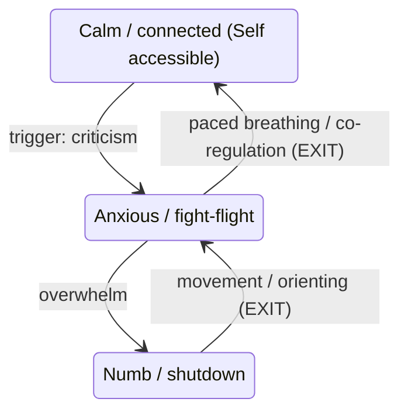
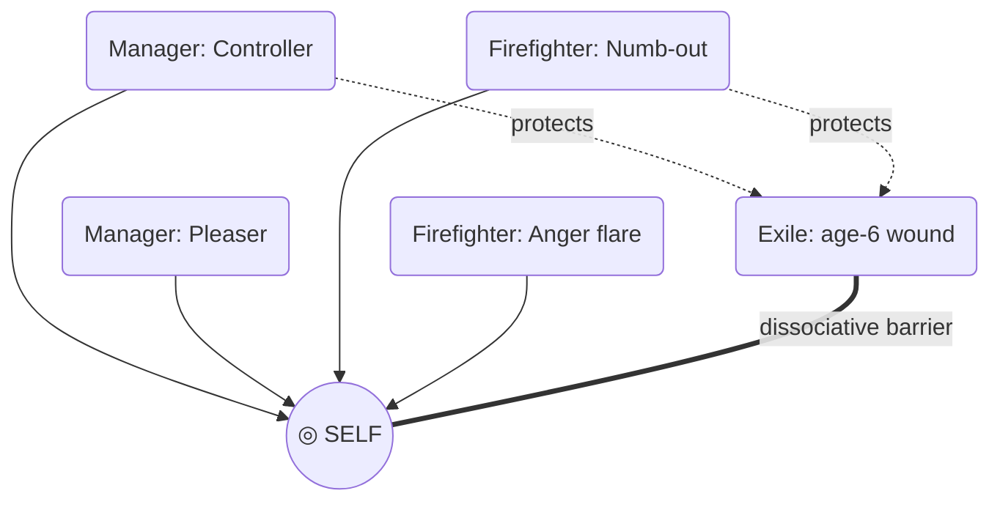
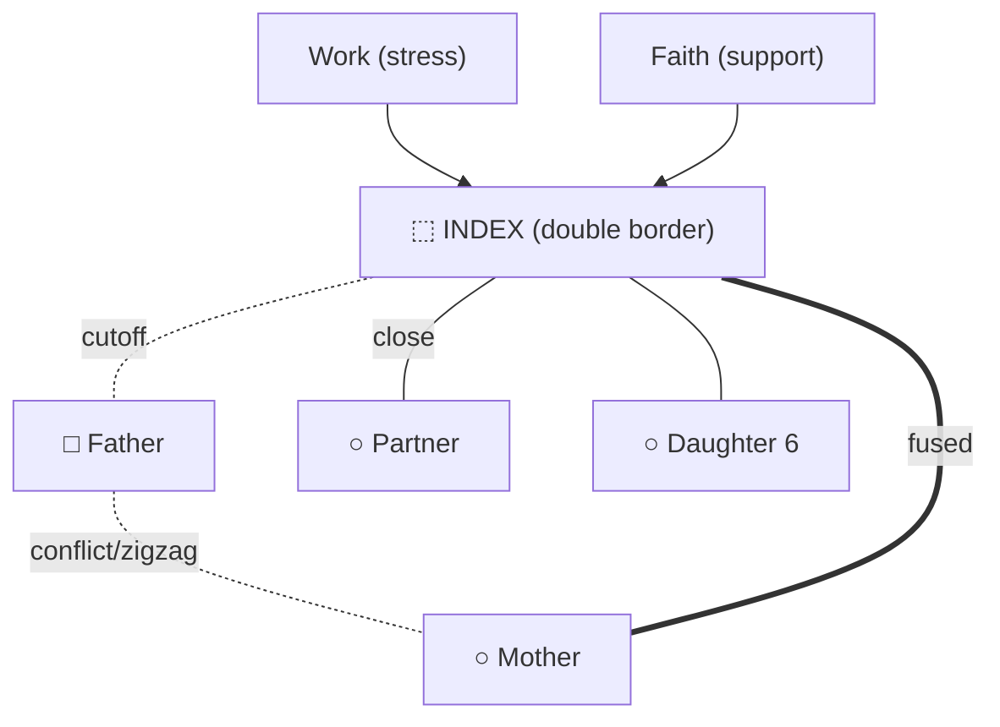
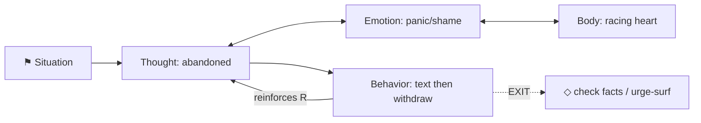
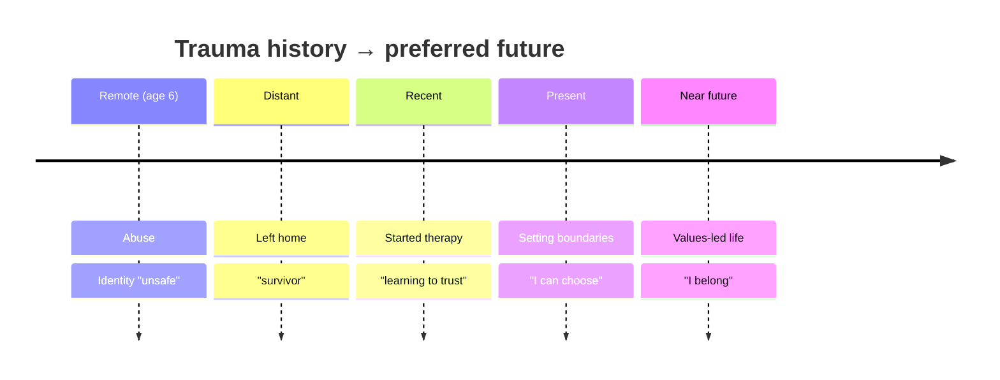
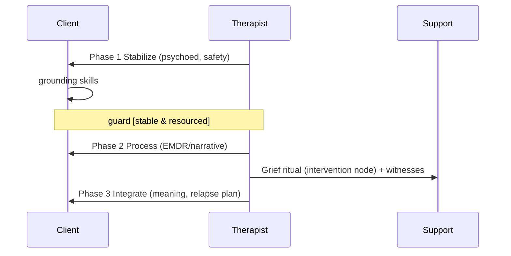
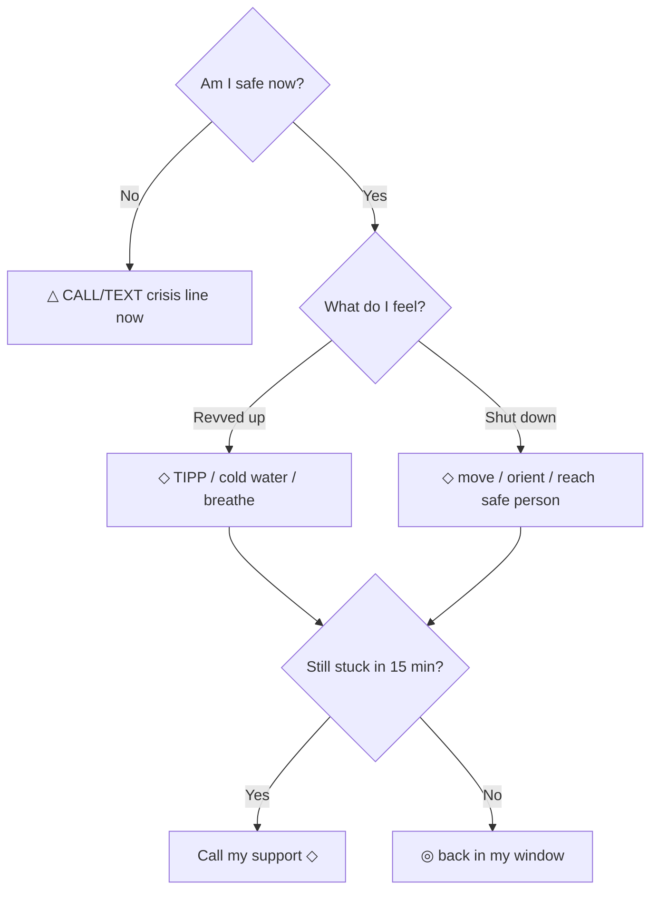
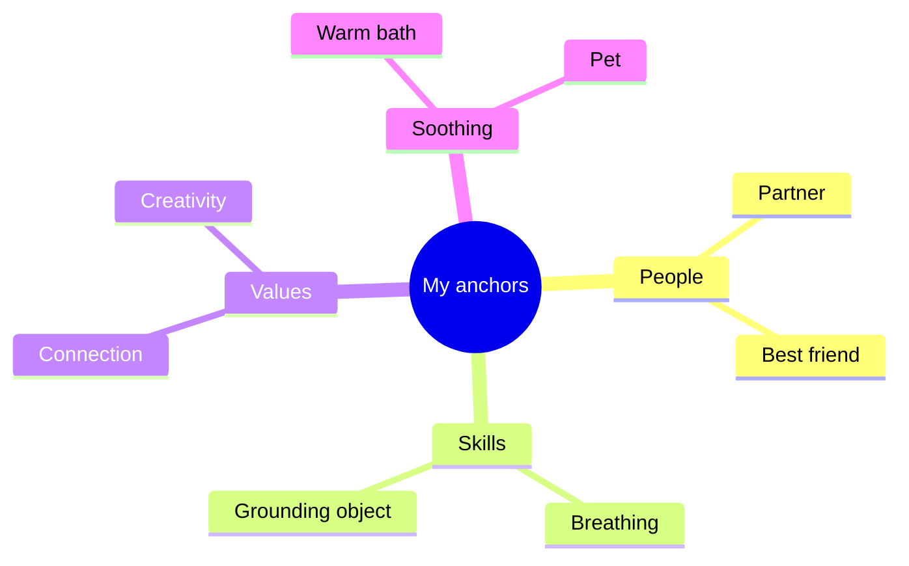
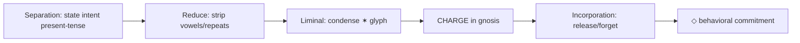

# PsyUML v0.1 — A Unified Visual Modeling Language for Psychotherapy
## Specification Document

**Version:** 0.1.0 (semantic versioning; pre-1.0 = syntax may change between minor versions)
**Status:** Draft for community review
**Date:** June 12, 2026

**Abstract:** PsyUML is a cross-school, dual-audience visual modeling language for representing psychological states, internal agents, relationships, maintaining processes, change trajectories, therapeutic interventions, and ritual operations — analogous to what UML/SysML did for software and systems engineering, but for psychotherapy. It supplies a small modality-agnostic core ontology (Tier 1), clinician annotations (Tier 2), and school-specific overlays (Tier 3), each diagram readable at Tier 1 and progressively enrichable. It is designed to fill a documented gap. Case formulation is fragmented by theoretical school and frequently absent in routine practice: Abbas, Premkumar, Goodarzi & Walton, examining 150 assessment letters from a psychiatric clinic in Rotherham, U.K. (*Academic Psychiatry* 2013;37(5):336–338), found that "An overwhelming majority (94%) of letters did not include any case-formulation; this finding was not affected by the grade of the doctor." The nearest standardization analogs are textual reporting tools rather than visual case-formulation languages: Michie et al.'s Behavior Change Technique Taxonomy v1 (*Annals of Behavioral Medicine* 2013;46(1):81–95) — "This resulted in 93 BCTs clustered into 16 groups" — and the Behaviour Change Intervention Ontology. PsyUML is the visual language that does not yet exist.

**Audience guide:** Clinicians read all three tiers. Clients read Tier 1 ("client-facing layer") plus the crisis/resource templates. Every diagram type is specified at both a clinician layer and a client layer. Magical ritual is a first-class modality, framed honestly per the evidence base.

---

## TL;DR

- **PsyUML is a complete, three-tier visual modeling language** that gives psychotherapy what UML gave software: a small hand-drawable core ontology (8 element types, 8 core symbols) that every diagram type instantiates, progressively enrichable with clinician annotations and school-specific overlays — directly answering the documented 94%-absent case-formulation gap (Abbas et al. 2013, Rotherham).
- **It is genuinely cross-school and genuinely dual-audience:** the same map renders in IFS, schema, structural-dissociation, CAT, CBT, somatic, and ritual vocabularies via provenance tags and a translation table that *preserves* (never flattens) real theoretical disagreements, and every diagram has a plain-language, non-pathologizing client layer plus a crisis-usable Decision/Navigation Chart.
- **Magical ritual is a first-class modality with full ontology parity** to clinical interventions (a grief rite functions as both an Intervention node and a trajectory transition trigger), framed honestly per the evidence: ritual reliably affects *subjective* anxiety, felt control, and meaning (open-label placebo SMD ≈ 0.72; von Wernsdorff et al. 2021) but NOT *objective* disease markers (SMD = −0.02; Spille et al. 2023) — so the spec forbids any claim that a ritual cures medical disease.

---

## Key Findings

1. **A coherent small core is achievable.** Eight abstract element categories (State, Agent/Part, Relation, Process/Transition, Intervention, Resource/Anchor, Context, Temporal Structure) plus a typed connector set are sufficient to subsume the major diagrammatic traditions (polyvagal ladder, IFS parts maps, genograms, CAT SDR, CBT maintenance cycles, narrative landscapes, DBT chains, ACT matrix/choice point, CFT three circles) without symbol overload.

2. **Existing standards should be adopted, not reinvented.** The McGoldrick–Gerson–Petry genogram set (4th ed. 2020) is a de facto international standard and is adopted wholesale for the relational layer; CAT's loops-with-exits, observing-eye, and collaborative-drawing ethos; Harel statecharts for state maps; system-dynamics reinforcing/balancing loops for edges; van Gennep's separation→liminal→incorporation arc for ritual.

3. **Ritual achieves ontology parity honestly.** Ritual structures map onto the same metamodel as clinical interventions, with an explicit, evidence-grounded, non-medical framing and a mandatory secular variant of every template.

4. **Theoretical conflicts are real and must be preserved.** A parts map looks identical across IFS, schema, structural dissociation, TA, and Jungian frames, but the *origin claims* (innate multiplicity vs. trauma-caused division vs. developmental formation vs. transpersonal) are genuinely opposed; PsyUML's provenance tags keep visual similarity from erasing conceptual difference.

5. **The design holds up against notation science.** Scored against Moody's nine Physics-of-Notations principles (mean ≈ 4.3/5 after one iteration) and the Cognitive Dimensions checklist, with the weakest dimensions (semiotic clarity under cross-school glyph reuse; semantic transparency of abstract tokens) fixed by mandatory provenance tags and iconic markers.

---

## §A. CORE ONTOLOGY (abstract / concrete / semantic syntax)

PsyUML separates three layers, UML-style: **abstract syntax** (element types + well-formedness rules), **concrete syntax** (glyphs/colors/connectors), and **semantics** (what each construct asserts about the person).

### A.1 Element categories (metamodel)

| Element | Formal definition | Default glyph | Tier | School synonyms |
|---|---|---|---|---|
| STATE | A condition the system can occupy at a time; mutually exclusive within a band | Rounded rectangle | 1 | autonomic state (polyvagal), schema mode, mood, ego-state-as-active |
| AGENT/PART | A persisting sub-personality or actor with its own aims | Circle/oval (person-like) | 1 | IFS part, TA ego-state, ANP/EP, complex, godform |
| RELATION | A standing connection between agents/people | Line between agents | 1 | reciprocal role, attachment bond, transaction, genogram tie |
| PROCESS/TRANSITION | A movement/transformation over time | Arrow (typed) | 1 | procedure/trap, maintenance cycle, chain link, phase transition |
| INTERVENTION | A deliberate act intended to change the system | Hexagon (annotation) | 1 | CBT technique, DBT skill, somatic exercise, ritual operation |
| RESOURCE/ANCHOR | A stabilizing support | Diamond/anchor | 1 | coping skill, safe person, values anchor, talisman |
| CONTEXT | Environmental/cultural frame; container | Swimlane / dashed box | 1 | situation, system, lifeworld, "field" |
| TEMPORAL STRUCTURE | Timeline / phase band | Horizontal axis or band | 1 | life-line, longitudinal formulation, van Gennep arc |

### A.2 Well-formedness rules (abstract syntax)
1. Every STATE belongs to exactly one BAND (e.g., a polyvagal/WoT band) or to no band (free state).
2. A TRANSITION connects exactly one source and one target node; it may carry a TRIGGER label.
3. A RELATION connects two AGENTS or two PEOPLE; it is undirected unless typed reciprocal.
4. An INTERVENTION attaches to a node OR an edge (never floats unattached).
5. A LOOP is a closed path of ≥2 TRANSITIONS; it must be typed reinforcing (R) or balancing (B), and SHOULD carry ≥1 marked EXIT.
6. A DISSOCIATIVE BARRIER may only separate AGENTS/STATES, never PEOPLE.
7. Every client-facing diagram MUST carry a disclaimer field and (for crisis/decision charts) a crisis-resource field.

### A.3 Semantics (what constructs assert)
- A STATE asserts: "the person can be in this condition; it is one of several." A TRANSITION asserts a claim of *temporal/causal succession*. A REINFORCING LOOP asserts *self-amplification* ("the more X, the more Y, the more X"). An EXIT asserts *an available alternative response that breaks the loop*. A DISSOCIATIVE BARRIER asserts *restricted information/affect flow between parts*. An INTERVENTION asserts *a hypothesis that acting here changes the system*. None of these assert diagnosis; PsyUML is formulation-level, not nosology.

---

## §B. NOTATION REFERENCE (full symbol table)

| Glyph (ASCII) | Name | Tier | Meaning | School synonyms | Hand-drawn | Color (non-color fallback) |
|---|---|---|---|---|---|---|
| `( ... )` rounded rect | State node | 1 | A condition of the system | mode, autonomic state | rounded box | neutral grey (label only) |
| `(O name)` circle | Agent/Part | 1 | Sub-personality/actor | part, ego-state, ANP/EP | circle | blue (solid border) |
| `<<self>>` ◎ | Self / core | 1 | Non-pathological centre | IFS Self, Adult, "wise mind" | circle with dot | gold (double ring) |
| `◇` diamond | Resource/Anchor | 1 | Stabilizing support | skill, safe person, values | diamond | green (thick border) |
| `⬡` hexagon | Intervention | 1 | Deliberate change act | technique, skill, rite | hexagon | purple (hatched fill) |
| `👁`/`(eye)` | Observing eye/I | 1 | Self-reflective stance | CAT observing eye, "wise mind", mentalizing | small eye | outline only |
| `▭` swimlane | Context/Role lane | 1 | Who/what owns an action | system, field, role | labelled column | dashed border |
| `▮▮▮` band | Phase/arousal band | 1 | Ordered zone | WoT band, van Gennep phase | horizontal stripe | pattern not hue |
| `⚑` flag | Trigger marker | 2 | Precipitant on a transition | prompting event, cue | small flag | red flag (label "trigger") |
| `△` warning | Risk/safety flag | 2 | Risk point | crisis trigger | triangle + "!" | red triangle |
| `[w:0.8]` | Edge weight | 2 | Causal strength 0–1 | FACCD weight | number on arrow | numeral |
| `{school:CAT}` | School tag | 2 | Provenance of a construct | — | bracket label | text |
| `~conf:M~` | Confidence/evidence | 2 | Hypothesis strength L/M/H | — | tilde label | text |
| `⊕`/`⊖` | Excit./inhib. node role | 3 | EEMM/process polarity | — | + / − | text |
| `[ANP]/[EP]` | Dissociation type tag | 3 | Structural-dissociation role | van der Hart ANP/EP | bracket | text |
| `✶ sigil` | Sigil/glyph token | 3 | Condensed intent symbol | chaos-magic sigil | freehand glyph | outline |

**Graphic economy:** Tier-1 core = 8 node/marker symbols (state, agent, Self, resource, intervention, observing-eye, context-lane, phase-band) — within working-memory limits, per Moody's graphic-economy principle.

---

## §C. CONNECTOR / RELATION REFERENCE

| Connector (ASCII) | Name | Tier | Semantics | Source tradition |
|---|---|---|---|---|
| `--->` | Sequential/causal | 1 | A leads to B | universal |
| `==>` (or `+`) | Excitatory causal | 2 | A increases B | FACCD, Borsboom, system dynamics |
| `--•` (or `−`) | Inhibitory causal | 2 | A decreases B | FACCD, system dynamics |
| `<-->` | Reciprocal/bidirectional | 1 | Mutual influence | CBT hot-cross-bun, CAT reciprocal role |
| `((R))` loop label | Reinforcing loop | 2 | Self-amplifying cycle | system dynamics, CBT maintenance |
| `((B))` loop label | Balancing loop | 2 | Self-correcting cycle | system dynamics |
| `--//-->` | Delay marker | 2 | Lag between cause/effect | system dynamics |
| `==EXIT==>` | Exit/escape | 1 | Alternative breaking a loop | CAT exits |
| `║ ║` double bar | Dissociative barrier | 3 | Restricted flow between parts | structural dissociation |
| `(((O))` orbit | Containment/protection | 2 | Protector around exile / cast circle | IFS, ritual boundary |
| `⟿` | Invocation | 3 | Calling a figure into the field | ritual, active imagination |
| `⤬` zigzag | Conflict tie | 1 | Hostile relationship | genogram zigzag |
| `===` triple line | Fused/enmeshed | 2 | Over-close relationship | genogram fused |
| `- - -` dashed | Distant tie | 1 | Distant relationship | genogram distant |
| `-/ /-` broken | Cutoff/estrangement | 1 | Severed relationship | genogram cutoff |

**Genogram relational set adopted wholesale** (McGoldrick, Gerson & Petry, *Genograms: Assessment and Intervention*, 4th ed., W.W. Norton 2020): square=male, circle=female, diamond=nonbinary/unknown, X=deceased, double-border=index person; solid=close, zigzag=conflict, triple=fused/enmeshed, dashed=distant, broken=cutoff. This set is taught internationally and standardizes >150 symbols across structural, relationship, emotional, and medical categories — there is no reason to compete with it.

---

## §D. COLOR & ACCESSIBILITY SEMANTICS

**Principle (Moody dual coding + accessibility):** color is *always redundant* with shape + text. No meaning is ever encoded by color alone. This matters because red–green color vision deficiency affects up to 1 in 12 (≈8%) of males and ≈0.5% (1 in 200) of females of Northern European descent (it is X-linked).

Colorblind-safe palette (Okabe–Ito-derived) + mandatory non-color encoding:

| Concept | Color | Non-color encoding |
|---|---|---|
| State (neutral) | grey | rounded rectangle + label |
| Agent/Part | blue | circle + name |
| Self/core | gold/orange | double ring + dot |
| Resource/anchor | green (bluish) | diamond + thick border |
| Intervention | purple | hexagon + hatched fill |
| Threat/risk/trigger | vermilion red | triangle/flag + "!" + word |
| Soothing/safe | sky blue | wavy underline |
| Reinforcing loop | — | "R" inside circular arrow |
| Balancing loop | — | "B" inside circular arrow |

Accessibility requirements: hand-drawable in monochrome; every glyph distinguishable by shape; minimum 14pt text in client layer; phase bands use pattern (dots/diagonal/cross-hatch) not hue.

---

## §E. DIAGRAM-TYPE CATALOG

For each: purpose; core elements; ASCII + Mermaid; clinician vs client layer; hand-drawn guidance; originating schools; compatibility note (full matrix in §G).

### E.1 STATE MAP
**Purpose:** Current and possible states + triggers/transitions. Subsumes polyvagal ladder, window of tolerance, mood maps. **Originating schools:** somatic/polyvagal (Deb Dana), Siegel's window of tolerance; structurally derived from Harel statecharts.

**Concrete notation:** vertical arousal axis, three banded zones (ventral/safe top; sympathetic/mobilized middle; dorsal/shutdown bottom), states inside bands, transitions labelled with triggers, exits to regulation.

ASCII (clinician layer):
```
 ┌─ VENTRAL / SAFE-SOCIAL (top of ladder) ────────────┐
 │ (Calm-connected) ◎Self accessible                  │
 └───▲───────────────────────────│────────────────────┘
     │ glimmer/co-regulation      │ ⚑ trigger: criticism
 ┌─ SYMPATHETIC / MOBILIZED ──────▼────────────────────┐
 │ (Anxious/fight-flight)  ==EXIT==> ◇paced breathing  │
 └───▲───────────────────────────│────────────────────┘
     │ ⚑ activation                │ ⚑ overwhelm
 ┌─ DORSAL / SHUTDOWN (bottom) ───▼────────────────────┐
 │ (Numb/collapse)  ==EXIT==> ◇orienting+movement      │
 └─────────────────────────────────────────────────────┘
```
Note (verified, Deb Dana / polyvagal): the ladder is a *hierarchy* — to exit dorsal shutdown one passes *up through* sympathetic mobilization, not directly to ventral. PsyUML encodes this as an ordered band: a dorsal→ventral transition must traverse the sympathetic band.

Mermaid (clinician):


**Client layer** ("My nervous system ladder"): plain words ("Green = safe & social / Amber = revved up / Red = shut down"), the client's own metaphors and color, "what gets me here" and "what helps me climb." Disclaimer + crisis line fields attached.

**Hand-drawn (<2 min):** three stacked boxes, label each, draw two arrows up and two down with trigger words.

### E.2 PARTS / AGENTS MAP
**Purpose:** Internal sub-personalities and relations. Subsumes IFS, TA ego-states, schema modes, ANP/EP, ritual archetypes. **Originating schools:** IFS (Schwartz), TA (Berne), ego-state therapy, structural dissociation (van der Hart, Nijenhuis, Steele).

**Concrete notation:** ◎Self at centre; protectors orbiting (managers = proactive protectors; firefighters = reactive protectors that act when an exile breaks through); exiles inside a containment orbit; dissociative barriers as double bars; each part typed and Tier-3 tagged.

ASCII (clinician):
```
            (O Manager: "Controller")  (O Manager: "Pleaser")
                       \                 /
                        \               /
   (O Firefighter:       ◎ SELF        (O Firefighter:
     "Numb-out")        (8 C's)          "Anger flare")
                        /     ║ dissociative barrier ║
                 (((  (O Exile: "Little one, age 6")  )))
   Tags: Self-energy accessible? partial.  {IFS}/{schema}/{SD}
```

Mermaid:


**Translation-table tagging on the same map** (see §G.2): the age-6 exile = IFS "exile" = schema "Vulnerable Child mode" = structural-dissociation "EP" (emotional part) = ego-state-therapy "ego state" = Jungian "wounded-child complex." The map is identical; only the *claims* differ (IFS posits innate multiplicity + a non-pathological Self; structural dissociation posits trauma-caused division between an ANP that manages daily life and trauma-bearing EPs; TA posits developmentally-formed states; Jungian/ritual figures may be framed transpersonally — NOT identical claims).

**Client layer** ("My inner team / parts of me"): friendly names the client chooses, no "exile/firefighter" jargon ("the part that protects me by going numb"), strengths emphasized, no diagnostic labels.

**Hand-drawn:** Self in the middle, parts as bubbles around it; draw a line from each protector to the young part it guards.

### E.3 RELATIONAL FIELD DIAGRAM
**Purpose:** Interpersonal/family/social field. Subsumes genograms, ecomaps, sociograms, drama triangle, attachment bonds. **Originating schools:** Bowen/McGoldrick genogram; systemic/structural (Minuchin); TA Karpman drama triangle (Persecutor/Rescuer/Victim with role-switches).

Uses the McGoldrick–Gerson–Petry symbol set wholesale plus ecomap extensions to external systems (work, faith, services) drawn as outer circles with close/stressed/tenuous ties.

ASCII (clinician):
```
   [□ Father]═══zigzag═══[○ Mother]        (ecomap)
        |  cutoff (-/ /-)     | fused (===)        ( Work )--stress--+
   [⬚ INDEX PERSON, 34]------close----[○ Partner]  ( Faith )--close--+--> INDEX
        |                                          ( GP/Service )--tenuous
   [○ Daughter, 6]
```

Mermaid (approximation; genogram glyphs noted in labels):


**Client layer:** "My relationship map / my circles of support" — concentric circles (me → close → wider), draw lines (smooth = warm, jagged = tense, dotted = distant), name supports. Drama-triangle overlay available as a plain "rescue/blame/stuck-feeling roles" reflection.

### E.4 PROCESS / LOOP DIAGRAM
**Purpose:** Maintaining cycles, vicious/virtuous loops, feedback. Subsumes CAT traps/dilemmas/snags, CBT maintenance cycles (Padesky–Mooney five-part "hot cross bun": situation → thoughts ⇄ emotions ⇄ physical sensations ⇄ behaviors), Borsboom symptom networks, system-dynamics causal-loop diagrams. **Must mark exits.** **Originating schools:** CAT (Ryle), CBT, network theory (Borsboom), systemic.

ASCII (CBT "hot cross bun" + maintenance loop, clinician):
```
        ⚑ Situation: partner late replying
                 |
                 v
   (Thought: "I'm being abandoned") <==> (Emotion: panic, shame)
                 ^   ((R))                      |
                 |                              v
   (Behavior: text repeatedly,   <==>  (Body: racing heart)
    then withdraw)
                 |
        ==EXIT==> ◇ "check the facts" / ◇ urge-surf / ◇ self-soothe
```

Mermaid:


**CAT rendering of the same loop:** reciprocal roles in ovals (abandoning→abandoned), the procedure as the trap, the observing-eye glyph, marked exits — collaboratively drawn (per CAT, "think reciprocally from the start"; exits "need to be elaborated early"). **Borsboom rendering:** symptoms as nodes (insomnia, hypervigilance, rumination), edges as empirically-weighted causal links, feedback loops and a hysteresis note.

**Client layer:** "My stuck loop / vicious cycle" — 3–5 bubbles in a circle with arrows, then a bright "way out" arrow at the point the client feels they have most leverage.

### E.5 TIMELINE / TRAJECTORY DIAGRAM
**Purpose:** Life-line, change trajectory, narrative landscapes over time. Subsumes narrative therapy time×landscape grid, longitudinal CBT formulation, relapse/recovery curves. **Originating schools:** narrative therapy (Michael White, *Maps of Narrative Practice*, 2007); CBT longitudinal; recovery models.

Narrative grid (verified from White's workshop notes): vertical = two landscapes (LANDSCAPE OF ACTION = events, circumstance, sequence, time, plot; LANDSCAPE OF IDENTITY = meaning/values/reflections); horizontal time axis = remote history → distant history → recent history → present → near future.

ASCII (clinician):
```
TIME →   remote     distant     recent     PRESENT    near future
ACTION   abuse(6)   left home   therapy    boundaries  ↗ values-led
IDENTITY "unsafe"   "survivor"  "learning  "I can      "I belong"
                                 to trust"  choose"
         |---------- problem-saturated ----|--unique outcomes-->
```

Mermaid (timeline):


**Client layer:** "My story line / river of life" — a drawn river or road with high/low points, "turning points," and an arrow into the future the client wants. Externalizes the problem as a separate named character ("the person is not the problem, the problem is the problem").

### E.6 INTERVENTION SEQUENCE DIAGRAM
**Purpose:** Ordered/conditional therapeutic actions. Subsumes phased trauma treatment (stabilization → processing → integration), DBT chain-analysis interventions, stepped-care pathways. **Originating schools:** UML sequence/BPMN; phase-oriented trauma treatment (Herman/van der Hart); DBT (Linehan).

Swimlanes = actors (client, therapist, support system, ritual/operator). Interventions = hexagons in sequence with guards `[if X]`.

ASCII (clinician):
```
CLIENT        | THERAPIST                | SUPPORT
--------------|--------------------------|-----------------
              | ⬡ Phase 1 STABILIZE      |
⬡ grounding   |  psychoeducation, safety |  ◇ safe person
  skills      |  [if dissociation high]  |
              |  ⬡ parts-mapping         |
--------------|--------------------------|-----------------
[guard: stable & resourced] -------------> Phase 2
              | ⬡ Phase 2 PROCESS        |
              |  EMDR / narrative        |
              |  ⬡ GRIEF RITUAL (node)   |  witnesses
--------------|--------------------------|-----------------
              | ⬡ Phase 3 INTEGRATE      |
⬡ values-led  |  relapse plan, meaning   |  community
  action      |                          |
```

Mermaid (sequence):


DBT chain-analysis interventions are a specialization of this type: vulnerability factors → prompting event → links (thoughts/emotions/sensations/urges) → problem behavior → consequences, with replacement-skill hexagons attached at "choice points" along the chain.

**Client layer:** "My therapy roadmap / steps" — three big stepping stones (Get steady → Work it through → Build my life), with "I'm here" marker.

### E.7 RITUAL STRUCTURE DIAGRAM — see §F (first-class).

### E.8 DECISION / NAVIGATION CHART
**Purpose:** Crisis navigation, decision support, "if X then route to Y." Subsumes safety plans, ACT choice points, clinical decision trees. **Must be usable mid-crisis by a client alone.** **Originating schools:** flowchart/decision tree; Stanley–Brown safety planning; ACT (Harris's Choice Point — away vs. toward moves at a fork).

ASCII (client crisis chart):
```
        ┌─────────────────────────────┐
        │  Am I safe right now?        │
        └──────────┬─────────┬─────────┘
              NO / unsafe    YES
                   │           │
        △ CALL/TEXT NOW:       ▼
        [crisis line ____]   "What do I feel?"
        [988 / local ___]      │
        emergency services    ┌┴─────────────┐
                          revved up?      shut down?
                              │               │
                          ◇ TIPP / cold    ◇ move / orient /
                            water / breathe   reach a safe person
                              │               │
                          "Still stuck after 15 min?"──► call support ◇
```

Mermaid:

Choice-point primitive (ACT): a fork with "away moves" (toward short-term relief from discomfort) vs "toward moves" (toward values), with hooked/unhooked labels.

**Clinician layer:** adds risk stratification, guards, contraindications, evidence tags.

### E.9 RESOURCE / ANCHOR MAP
**Purpose:** Strengths, supports, coping skills, values, protective resources. Subsumes ACT bullseye values, CFT soothing-system, safety/grounding inventories. **Originating schools:** ACT, CFT (Gilbert three circles — threat/drive/soothing), strengths-based/positive psychology, somatic grounding.

ASCII (client):
```
            ◇ VALUES (my bullseye)
        ┌─────────────────────────────┐
        │   ◇ People who help me       │
        │   ◇ Places that calm me      │
        │   ◇ Things I do (skills)     │
        │   ◇ Strengths I have         │
        │   ◇ Soothing-system boosters │
        └─────────────────────────────┘
   CFT three circles:  (Threat)  (Drive)  (Soothing←grow this)
```

Mermaid:


**Clinician layer:** maps each anchor to the state/loop it counteracts (cross-reference to State Map and Loop Diagram), tags CFT system and EEMM dimension.

---

## §F. RITUAL MODALITY (first-class)

Ritual is representable with the **same core ontology** as any clinical intervention.

**Honest framing (embedded in every ritual template):** The evidence base shows rituals reliably regulate three things. Hobson, Schroeder, Risen, Xygalatas & Inzlicht (*Personality and Social Psychology Review* 2018;22(3):260–284) state: "Our framework focuses on three primary regulatory functions of rituals: regulation of (a) emotions, (b) performance goal states, and (c) social connection." Meaning and ritual can help even *without* deception (open-label placebo). Kaptchuk et al. (*PLoS ONE* 2010;5(12):e15591), in 80 IBS patients (Rome III, IBS-SSS ≥150), found that comparing open-label placebo to no treatment, "nearly twice as many patients treated with the placebo reported adequate symptom relief... (59 percent vs. 35 percent)"; Lembo, Kelley, Ballou et al. (*PAIN* 2021) later found open-label placebo ≈ double-blind placebo in IBS. The meta-analysis of von Wernsdorff, Loef, Tuschen-Caffier & Schmidt (*Scientific Reports* 2021;11:3855; 13 studies reviewed, 11 meta-analyzed) reported an "overall effect size of SMD = 0.72" (95% CI 0.39–1.05) — while noting hints of publication bias and a small study base. BUT effects are predominantly SUBJECTIVE: Spille et al. (*Scientific Reports* 2023; 20 studies, 1,201 non-clinical participants) found "a significant effect of OLPs for self-reported outcomes (k = 13; SMD = 0.43; 95% CI = 0.28, 0.58...), but not for objective outcomes (k = 8; SMD = −0.02; 95% CI = −0.25, 0.21...)." This is the "meaning response" (Moerman & Jonas, *Annals of Internal Medicine* 2002). **Bottom line: ritual reliably affects subjective anxiety, felt control, and meaning, and does NOT reliably change objective disease markers. Never imply a ritual cures medical disease.**

### F.1 Ritual Structure Diagram constructs
- **Phase band (van Gennep arc):** SEPARATION (pre-liminal) → LIMINAL (threshold) → INCORPORATION (post-liminal). Maps the symbolic state transition: old identity/burden → transformation → new identity/integration. Trauma is modeled as an *involuntary, uncompleted rite of passage* (stuck in liminality, "betwixt and between"); therapy/ritual supplies the missing incorporation phase (van Gennep; Turner's liminality and communitas).
- **Intention → Charge → Release** operative core: intent-setting node ⬡ → charging/energizing node ⬡ → release/banishing node ⬡.
- **Roles (swimlanes):** celebrant/operator, witness(es), invoked figures/archetypes/deities, the subject undergoing transition.
- **Correspondences (typed annotations):** `@element`, `@direction`, `@color`, `@material`, `@timing`, `@card/rune/sephirah`.
- **Boundary/containment connector:** cast circle / banishing perimeter / "safe container."

### F.2 Worked ritual: SIGIL OPERATION (Spare method)
Psychological frame: intention-setting + behavioral commitment + cognitive defusion. Verified five-stage chaos-magic grammar (after Spare's *The Book of Pleasure*, 1913; systematized by Carroll's *Liber Null*): state intent in present tense → strip repeated letters and vowels → condense remaining consonants into an abstract glyph → charge in gnosis (an altered "no-mind" state) → release/forget (destroy or normalize the sigil; the "forgetting" prevents anxious "lust of result").
```
SEPARATION ──────────► LIMINAL ──────────► INCORPORATION
⬡ State intent        ⬡ Condense to glyph   ⬡ Release/forget
 (present tense)       ✶ (strip vowels/      (destroy or
⬡ Reduce letters         repeats)             normalize sigil)
                      ⬡ CHARGE in gnosis     ◇ behavioral commitment
@material: paper      @timing: peak state    follows
```
Mermaid:


### F.3 Worked ritual: TAROT SPREAD as reflective/assessment template
The **Celtic Cross** (A.E. Waite, *The Pictorial Key to the Tarot*, 1910, "the Ancient Celtic Method of Divination") is a fixed 10-position layout — used here as a structured-reflection template, NOT as a divination claim. It comprises a 6-card cross (positions 1–6) and a 4-card staff (7–10), with an optional chosen significator. The 10 positions map onto a State Map / Parts Map:

| Pos | Celtic Cross meaning (Waite-derived) | PsyUML mapping |
|---|---|---|
| 1 | Present / heart of the matter ("this covers it") | current STATE |
| 2 | Challenge / crossing ("this crosses it") | the loop / obstacle |
| 3 | Crown / conscious aim ("this crowns it") | values/goal (Resource) |
| 4 | Foundation / root ("this is beneath it") | core belief / exile |
| 5 | Past influence ("this is behind it") | timeline (recent history) |
| 6 | Near future ("this is before it") | timeline (near future) |
| 7 | Self / attitude | Self-state |
| 8 | Environment / others | Relational Field |
| 9 | Hopes and fears | ambivalence / parts conflict |
| 10 | Outcome / culmination | preferred-future node |

Used as a **statement-of-position prompt set**: each card position is a reflective question, not a prediction. (Note: positions 5/6 can swap with significator orientation; significator is optional.)

### F.4 Worked ritual: RITE OF PASSAGE / TRANSITION RITE (grief ritual)
Cross-referenced to White's rite-of-passage maps and Imber-Black & Roberts's therapeutic family rituals (co-created, never imposed; the Milan school's prescribed rituals are a related lineage).
```
SEPARATION ───────────► LIMINAL ──────────────► INCORPORATION
⬡ name the loss        ⬡ threshold act:          ⬡ re-entry:
  (mark the ending)      letter to deceased /      take a symbol forward
@material: photo,        burn / bury / release    ⬡ witnesses affirm
 candle                 (((boundary: safe         new status
[role: subject]          container)))             @timing: anniversary
[role: witnesses] -------------------------------> [community welcomes]
```

### F.5 Worked ritual: BANISHING / BOUNDARY RITUAL
LBRP-structured (verified Golden Dawn form) OR secular "boundary-setting" rite. Cross-referenced to DBT/CFT grounding and somatic down-regulation.

Verified LBRP structure (Regardie, *The Golden Dawn*; Crowley, *Liber O*; standard Golden Dawn form):
1. **Qabalistic Cross** — touch forehead "Ateh," breast/down "Malkuth," right shoulder "ve-Geburah," left shoulder "ve-Gedulah," clasp hands at breast "le-Olahm, Amen."
2. **Four pentagrams** at the quarters (begin East, clockwise) with vibrated divine names: **EAST = YHVH**, **SOUTH = Adonai**, **WEST = Eheieh**, **NORTH = AGLA**; connect with a circle of light.
3. **Four archangels:** "Before me RAPHAEL" (East/Air), "Behind me GABRIEL" (West/Water), "On my right hand MICHAEL" (South/Fire), "On my left hand URIEL/Auriel" (North/Earth); "about me flame the pentagrams, and within me shines the six-rayed star." (Note the counter-intuitive but standard mapping: Gabriel=West, Michael=South, because the operator faces East.)
4. **Qabalistic Cross** repeated (closing/seal).

```
SEPARATION ──────────► LIMINAL ──────────► INCORPORATION
⬡ Qabalistic Cross    ⬡ cast 4 pentagrams  ⬡ Qabalistic Cross
 (center self)         (((boundary cast))) (seal)
@direction: E/S/W/N   ⟿ invoke 4 archangels ◇ felt sense of
@element: A/F/W/E     ⬡ central working      contained safety
```
**Secular variant (offered for every ritual template):** "boundary-setting rite" — stand, name your edges aloud, physically mark a circle, state what you keep out and what you let in, ground through the feet. No belief required. (A Norse/heathen *blót* would substitute the phase labels Hallowing → Calling/Invocation → Petition/Bede → Blessing the drink → Sharing → Offering/Libation → Closing; note no single canonical liturgy exists and traditions vary by kindred.)

### F.6 Interoperability proof
- **Ritual as INTERVENTION NODE** inside an Intervention Sequence Diagram: the grief ritual hexagon ⬡ sits in Phase 2 (see §E.6 swimlane). Same hexagon glyph as a CBT technique.
- **Ritual as TRANSITION TRIGGER** in a Timeline/Trajectory Diagram: the grief ritual placed at the liminal→incorporation transition of a bereavement trajectory marks the state change from "stuck mourning" to "carrying forward."
Both use STATE, TRANSITION, INTERVENTION, ROLE/CONTEXT, and TEMPORAL-STRUCTURE from §A — demonstrating ontology parity with clinical diagrams.

---

## §G. CROSS-SCHOOL COMPATIBILITY

### G.1 Compatibility matrix (diagram type × school)
Values: **N** native · **A** adopt-as-is · **R** remap · **P** partial · **I** incompatible/rejected.

| Diagram ↓ / School → | CBT/3rd-wave | Psychodynamic | Schema | IFS/ego-state | Systemic/narrative | Humanistic/Gestalt | TA | Somatic/polyvagal | EMDR/struct.dissoc. | Jungian | Coherence/reconsol. | Ritual |
|---|---|---|---|---|---|---|---|---|---|---|---|---|
| State Map | A | R | N | A | R | A | R | N | A | R | A | R |
| Parts/Agents | R | R | N | N | R | P | N | A | N | N | P | R |
| Relational Field | R | A | R | R | N | R | A | R | R | R | R | P |
| Process/Loop | N | R | A | R | N | R | A | R | R | R | A | R |
| Timeline/Trajectory | A | A | A | A | N | A | A | A | A | A | A | R |
| Intervention Seq. | N | R | A | A | R | R | A | A | N | R | A | A |
| Ritual Structure | P | R | R | R | R(narrative) | R | R | R | R | A | R | N |
| Decision/Navigation | N | P | A | A | R | P | A | A | A | P | A | R |
| Resource/Anchor | N | R | A | A | R | N | A | N | A | R | A | R |

### G.2 Translation table (with honest caveats — do NOT flatten genuine differences)

**Parts family:**
| Construct | School | Distinct claim (NOT identical) |
|---|---|---|
| Part | IFS | innate multiplicity; non-pathological Self; parts carry burdens that can unburden |
| Mode | Schema therapy | states activated by unmet needs; some maladaptive coping modes |
| Ego-state | TA | developmentally-formed Parent/Adult/Child |
| ANP / EP | Structural dissociation | trauma-*caused* division (1 ANP/1 EP primary; 1 ANP/multi-EP secondary; multi/multi tertiary); integration is the goal |
| Ego state | Ego-state therapy | normal differentiation that can become rigid |
| Complex / archetype | Jungian | autonomous, partly transpersonal; individuation |
| Invoked figure / godform | Ritual | may be framed transpersonally or as a psychological device |

Caveat: IFS's "innate, non-pathological multiplicity" and structural dissociation's "trauma-caused division" are *theoretically opposed* origin claims even though the map looks the same. PsyUML tags provenance (`{school:...}`) so the visual similarity never erases the conceptual difference.

**Loop/cycle family:** CBT "maintenance cycle" ≈ CAT "procedure/trap/dilemma/snag" ≈ systemic "feedback loop" ≈ Borsboom "symptom-network feedback." Caveat: CBT presumes cognitive mediation; Borsboom is agnostic about mediation (symptom-to-symptom causation); CAT centres reciprocal *roles*.

**Belief/representation family:** CBT "core belief/schema" ≈ psychodynamic "internal working model" ≈ CAT "reciprocal role." Caveat: a reciprocal role is inherently *dyadic* (self–other), a core belief is propositional, an IWM is attachment-derived.

**Intent/value family:** ACT "values" ≈ narrative "preferred identity" ≈ ritual "intent." Caveat: ACT values are chosen directions (not goals); narrative preferred identity is socially constructed; ritual intent is operationalized as a present-tense statement.

**Modality-agnostic backbone:** the EEMM (Hayes, Hofmann & Ciarrochi 2020) supplies the dimensional spine — cognition, affect, attention, self, motivation, overt behavior, nested in biophysiological/sociocultural levels, with variation/selection/retention/context — that any school's nodes can be tagged against.

### G.3 Rejection analysis (who rejects what, and why)
- **Radical behaviorists / purely somatic therapists** reject the cognitive-mediation assumption behind the CBT Loop's thought→emotion arrows → they REMAP to functional ABC/SORC contingencies or pure interoceptive states.
- **Unitary-self humanistic / person-centred** therapists are wary of the Parts Map's *multiplicity* premise (a fragmented self may feel pathologizing) → PARTIAL: use "aspects of experience" framing, keep ◎Self central.
- **Strict psychoanalytic** clinicians may reject manualized Intervention Sequence Diagrams as incompatible with open-ended process → REMAP to a "phases of the work" sketch.
- **Many clinical schools** reject the *ontological claims* of ritual (deities/energies) → PsyUML's secular variants and honest evidence framing make the *structure* adoptable without the metaphysics.
- **Narrative therapists** may resist the State Map's internal-state language (prefer externalization) → REMAP states to externalized characters on a timeline.

---

## §H. WORKED CASE — Complex Trauma / CPTSD (all diagram types)

**Composite case "R." (fictional, 34):** childhood emotional abuse and neglect; current panic, dissociation, relationship conflict, self-criticism; partner supportive; mother enmeshed, father cutoff. Modeled end-to-end. (All identifying detail fictional.)

### H.1 State Map (clinician + client)
Clinician: ventral/sympathetic/dorsal bands; triggers = criticism (→sympathetic), conflict escalation (→dorsal); exits = paced breathing, orienting, partner co-regulation. Window of tolerance narrowed (trauma narrows the window). Client version: "green/amber/red ladder" with R.'s own words ("foggy" for dorsal, "wired" for sympathetic).

### H.2 Parts/Agents Map (3 vocabularies on one map)
◎Self (partially accessible) · Managers: "Controller" (perfectionism), "Pleaser" · Firefighters: "Numb-out" (dissociation), "Anger flare" · Exile: "age-6 little one" behind a dissociative barrier. **Tags:** IFS (part) / schema (Vulnerable Child + Detached Protector + Punitive Parent modes) / structural dissociation (ANP = daily-life self; EP = age-6 trauma-bearing part). Client version: "my inner team," friendly names, strengths noted.

### H.3 Relational Field Diagram
Genogram: ⬚ index R. (double border); ═══fused═══ to mother; -/ /- cutoff from father; ---close--- to partner; child age 6. Ecomap: work (stress), therapy service (supportive), faith/community (tenuous). Intergenerational pattern: emotional cutoff repeats across two generations.

### H.4 Process/Loop Diagram (CAT + CBT + Borsboom)
CBT: criticism → "I'm being abandoned" ⇄ panic/shame ⇄ racing heart → text-repeatedly-then-withdraw → (R) reinforces abandonment belief; EXIT = check-the-facts, urge-surf, self-soothe. CAT: reciprocal role "criticizing→criticized / abandoning→abandoned"; procedure = placate-then-withdraw trap; observing-eye added; exits named. Borsboom: nodes = hypervigilance, insomnia, rumination, withdrawal, shame; weighted edges; reinforcing loop hypervigilance↔insomnia.

### H.5 Timeline/Trajectory
Action: abuse(6) → left home(18) → therapy(now) → boundaries → values-led future. Identity: "unsafe" → "survivor" → "learning to trust" → "I can choose" → "I belong." Problem-saturated past → unique outcomes → preferred future. Externalized problem: "the Fog" / "the Critic."

### H.6 Intervention Sequence
Phase 1 Stabilize (psychoeducation, grounding, parts-mapping, safety plan) → [guard: stable & resourced] → Phase 2 Process (EMDR/narrative processing; **grief ritual node** for the un-mourned childhood) → Phase 3 Integrate (meaning-making, relapse prevention, values-led action). Swimlanes: client / therapist / partner+community.

### H.7 Ritual Structure (grief/incorporation rite as intervention node + trajectory trigger)
Separation: name the losses of childhood (candle, photo). Liminal: threshold act — letter to the child-self, read aloud to witnesses, then safely burned within a "safe container." Incorporation: carry a chosen symbol forward; witnesses affirm new status ("you survived; you belong now"). Placed in Phase 2 of §H.6 AND at the liminal→incorporation transition of the bereavement trajectory in §H.5. Secular framing; co-created with R.; consent-based; honest evidence note attached.

### H.8 Decision/Navigation Chart (client crisis/safety plan)
"Am I safe?" → No: △ crisis line ___ / 988 / emergency. Yes → "revved up?" → TIPP/cold water/breathe; "shut down?" → move/orient/text partner; "still stuck in 15 min?" → call support. Warning signs listed; reasons-for-living noted; means-restriction step included.

### H.9 Resource/Anchor Map
People (partner, best friend, therapist), skills (paced breathing, grounding object, 5-4-3-2-1), values (connection, creativity, fairness), soothing-system boosters (warm bath, pet, music). CFT three circles: threat large, drive moderate, soothing small → grow soothing. Each anchor cross-referenced to the state/loop it counteracts.

### H.10 Cross-reference (cognitive integration)
Each diagram carries navigation links: State Map "dorsal" ↔ Parts Map "Numb-out firefighter" ↔ Loop "withdraw" node ↔ Crisis Chart "shut down" branch ↔ Resource "orienting" anchor. The grief ritual in §H.7 is the same hexagon node referenced in §H.6 and §H.5. Shared IDs make a "where are we on the map?" navigation (CAT ethos) possible across the whole set.

---

## §I. DESIGN RATIONALE (decisions → principles → sources)

| Decision | Physics-of-Notations / Cognitive-Dimensions principle | Source tradition |
|---|---|---|
| Tier-1 core ≤ 8 symbols | Graphic economy; manageable complexity | Moody 2009 |
| Shape varies first, color redundant | Perceptual discriminability; dual coding; ≈8% of males have red–green CVD | Moody; health-literacy lit |
| Icons suggest meaning (eye, anchor, orbit) | Semantic transparency | Moody; CAT observing eye |
| Three tiers (core/extended/specialist) | Cognitive fit (dialects for audiences) | Moody; UML structural/behavioral split |
| Loops typed R/B with marked exits | Role-expressiveness; hidden-dependency reduction | System dynamics; CAT exits |
| Shared node IDs + navigation links | Cognitive integration | Moody; CAT "where are we on the map?" |
| Provenance tags `{school:…}` | Semiotic clarity (avoid symbol overload across schools) | Moody; PBT/EEMM common-language goal |
| Banded ordered states (polyvagal) | Role-expressiveness; secondary notation | Deb Dana; Siegel |
| Genogram set adopted wholesale | Don't reinvent a de facto standard; semiotic clarity | McGoldrick–Gerson–Petry 2020 |
| Ritual uses same ontology | Abstraction-gradient consistency; one metamodel | van Gennep; Hobson et al. 2018 |
| Client layer = plain, agentic, externalized | Cognitive fit; health literacy; "person ≠ problem" | White; pictograph recall lit |

Cognitive-Dimensions self-check: **viscosity** low (hand-redrawable; digital tools allow relabel); **hidden dependencies** mitigated by explicit cross-reference links; **premature commitment** low (start Tier 1, enrich later); **role-expressiveness** high (typed nodes/edges); **hard mental operations** reduced by small core; **secondary notation** supported (client's own metaphors/colors); **abstraction gradient** graded across three tiers.

---

## §J. SELF-EVALUATION RUBRIC RESULTS

### J.1 Physics of Notations (1–5)
| Principle | Score | Justification |
|---|---|---|
| Semiotic clarity | 4 | 1:1 glyph↔concept in core; some controlled overload where schools share a glyph (mitigated by tags) |
| Perceptual discriminability | 4 | Shapes distinct; risk: hexagon vs circle when hand-drawn fast |
| Semantic transparency | 4 | Eye, anchor, orbit, ladder are iconic; sigil token less transparent |
| Complexity management | 5 | Three tiers + sub-diagrams + swimlanes |
| Cognitive integration | 4 | Shared IDs + nav links; needs tooling to enforce |
| Visual expressiveness | 4 | Uses shape, position, texture, label, weight; color redundant |
| Dual coding | 5 | Text always paired with graphics |
| Graphic economy | 4 | Core = 8; Tier 3 deliberately large but optional |
| Cognitive fit | 5 | Clinician/client dialects + hand-drawn/screen variants |

**Mean ≈ 4.3/5 after iteration.**

### J.2 Cognitive Dimensions — addressed in §I (no red flags; weakest = hidden dependencies, mitigated by explicit links).

### J.3–J.7 Other criteria
- **Clinical utility:** A clinician can produce a Tier-1 formulation in minutes where 94% currently produce none (Abbas et al. 2013) — directly addresses the documented gap. **Pass.**
- **Layperson comprehension:** Tier-1 State Map, Parts Map, and Crisis Chart use plain words, shapes, and the client's own metaphors; crisis chart is single-decision-per-step. **Pass, pending usability testing** (flagged as unvalidated — see Caveats).
- **Cross-school coverage:** every diagram type has a verdict for every listed school (§G.1). **Pass.**
- **Ritual parity:** ritual representable with the same ontology + rigor as a CBT intervention (§F.6 proof). **Pass.**
- **Hand-drawability:** each Tier-1 diagram sketchable in <2 min (guidance given per type). **Pass.**

### J.4 Iteration (fixing weakest scores)
Weakest initial scores were **semiotic clarity** (cross-school glyph reuse) and **semantic transparency** (sigil/abstract tokens). **Changes made:** (1) added mandatory provenance tags `{school:…}` so a reused glyph never silently means two things; (2) added the observing-eye and anchor icons to raise transparency; (3) demoted abstract Tier-3 tokens out of the core. Re-scored: semiotic clarity 3→4, semantic transparency 3→4.

---

## §K. EXTENSION MECHANISM (profiles & stereotypes)

PsyUML extends WITHOUT breaking existing diagrams via a UML-style **profile** mechanism.
- **Profile:** a named bundle of extensions for a school/modality (e.g., "CFT profile," "Heathen-ritual profile").
- **Stereotype:** `«stereotype»` applied to a base element, adding constrained meaning (e.g., `«EP»` on an Agent). Stereotypes may add tags but may NOT remove base semantics.
- **Rules to add a new school/symbol/diagram type:**
  1. Map the new construct to a §A core element (every new symbol MUST specialize an existing element type).
  2. Assign a tier (new school-specific symbols default to Tier 3).
  3. Provide: glyph, hand-drawn form, color + non-color fallback, ≥1 synonym, a compatibility verdict for each existing diagram type.
  4. Prove it does not collide with an existing Tier-1 glyph (semiotic clarity check).
- **Versioning (semver):** PATCH = clarification/typo; MINOR = additive profile/stereotype (backward-compatible); MAJOR = core glyph/semantics change (may break diagrams). Tier-1 core is frozen within a MAJOR version.
- **Deprecation:** a symbol is marked `⚠deprecated` for one full MINOR cycle before removal; deprecated symbols keep rendering with a migration note.

---

## §L. GLOSSARY + ETHICAL-USE STATEMENT

### L.1 Glossary (selected)
**ANP/EP** — apparently normal part / emotional part (structural dissociation). **EEMM** — extended evolutionary meta-model: dimensions cognition, affect, attention, self, motivation, overt behavior × biophysiological/sociocultural levels, with variation/selection/retention/context (Hayes, Hofmann & Ciarrochi 2020). **Exit** — CAT alternative response breaking a loop. **Gnosis** — altered "no-mind" state used to charge a sigil. **Liminal** — van Gennep's threshold phase. **Observing eye/I** — CAT marker of self-reflective stance. **Reciprocal role** — CAT dyadic self–other pattern (e.g., abusing→abused). **Reinforcing/balancing loop** — self-amplifying vs. self-correcting feedback (system dynamics). **Window of tolerance** — Siegel's optimal arousal zone between hyper- and hypoarousal.

### L.2 Ethical-use statement (embedded, binding)
1. **Support, not replace.** PsyUML diagrams support, never replace, professional care. Every client-facing template carries a standing disclaimer and crisis-resource placeholders.
2. **Non-pathologizing client language.** Plain, non-stigmatizing, agentic wording; externalize the problem, not the person.
3. **Honest, non-medical ritual framing.** Ritual is a meaning-making / behavioral-activation / emotion-regulation modality, NOT evidence-based medical treatment. It reliably affects subjective anxiety, felt control, and meaning (open-label placebo SMD ≈ 0.72; von Wernsdorff et al. 2021) and does NOT reliably change objective disease markers (SMD = −0.02; Spille et al. 2023). Never imply a ritual cures medical disease.
4. **Cultural sensitivity.** Ritual content (Norse/heathen, Wiccan, Kabbalistic, Indigenous, etc.) is handled respectfully; appropriation risks flagged; a secular/neutral variant of every ritual template is offered; no specific belief is ever required.
5. **Collaborative & consent-based.** Diagrams are co-drawn with the client, who retains authorship and the right to relabel; no ritual is imposed that the person has not understood and agreed to (Imber-Black: co-created, not imposed; CAT: collaborative drawing ethos).
6. **Accessibility.** Never encode meaning in color alone; provide text + shape distinctions; ensure hand-drawability.

---

## Recommendations

**Stage 1 — Adopt the Tier-1 core now (no validation needed for low-risk use).** Clinicians can immediately use the State Map, Parts Map, Relational Field (genogram), and Loop Diagram as session formulation aids, and give clients the State Map, Resource/Anchor Map, and Crisis Chart. These reuse already-validated traditions (genograms, polyvagal ladder, CAT exits) and carry minimal novel risk. *Threshold to proceed:* none — these are formulation aids, not interventions.

**Stage 2 — Pilot the dual-layer and translation features with supervision.** Test the clinician↔client layer pairs and the cross-school translation tags in a small supervised caseload, gathering data on (a) whether clients can read the Tier-1 crisis chart unaided and (b) whether cross-school tagging changes formulation quality. *Threshold to expand:* clients reliably navigate the crisis chart in role-play, and supervisors judge formulations clearer/faster than narrative-only notes (the Abbas gap is the benchmark).

**Stage 3 — Use ritual templates only with explicit consent, honest framing, and a secular default.** Introduce ritual structure diagrams (grief/transition/boundary rites) only where (a) the client requests or endorses them, (b) the non-medical evidence framing is stated, and (c) the secular variant is offered first. *Stop/reconsider if:* a client attributes medical-curative power to a ritual (re-educate immediately), or any cultural-appropriation concern is raised (switch to secular variant).

**Stage 4 — Validate before any 1.0 release.** Commission formal usability testing (layperson comprehension of Tier-1 crisis charts), inter-rater reliability of clinician formulations, and a Delphi consensus across schools (mirroring how BCTTv1 reached consensus with ~400 experts). *Threshold for v1.0:* demonstrated layperson comprehension, acceptable inter-rater reliability, and multi-school endorsement. Until then PsyUML remains v0.x and its syntax may change.

**What would change these recommendations:** evidence that the Parts Map pathologizes unitary-self clients (→ make "aspects" framing the default), or that clients misread crisis charts under distress (→ simplify to a single-page two-decision flow), or new meta-analytic evidence that open-label/ritual effects extend to objective markers (→ revise the §L.2 framing).

---

## Caveats

- **PsyUML is unvalidated.** This is a v0.1 design specification, not an empirically tested instrument. Claims of clinical utility and layperson comprehension are design arguments grounded in notation science and the source traditions, not trial results. Formal usability, reliability, and consensus testing are required before clinical reliance.
- **The Abbas figure has a documented internal variant.** The published *Academic Psychiatry* (2013) figure is 94% of letters lacking any case formulation; an earlier unpublished version of the same dataset is sometimes cited as "only 16% included any formulation" (i.e., 84% absent). Both point to the same gap; the 94% figure is the peer-reviewed published number.
- **Ritual evidence is real but bounded and contested.** Open-label placebo and ritual effects are robust for *subjective* outcomes and meaning, weak-to-absent for *objective* disease markers; the von Wernsdorff meta-analysis itself flagged possible publication bias and a small study base. The spec's framing is deliberately conservative.
- **Theoretical translations are approximations, not equivalences.** The §G.2 mappings (parts ≈ modes ≈ ego-states ≈ ANP/EP ≈ complexes) connect *visually similar* constructs whose underlying claims genuinely conflict; provenance tags preserve but do not resolve those conflicts.
- **Ritual structural details vary by tradition.** The LBRP mapping is the standard Golden Dawn form (Regardie/Crowley), but neo-pagan sources sometimes reshuffle divine-name placements; the Celtic Cross has an orientation-dependent 5/6 swap and optional significator; the *blót* has no single canonical liturgy (and should not be conflated with the distinct *sumbel*). Treat all ritual templates as editable scaffolds, not fixed liturgy.
- **Mermaid rendering is approximate for genograms and bands.** Mermaid cannot natively draw McGoldrick glyphs or arousal bands; the Mermaid examples are structural approximations, with the authoritative notation in the ASCII renderings and §B/§C tables.