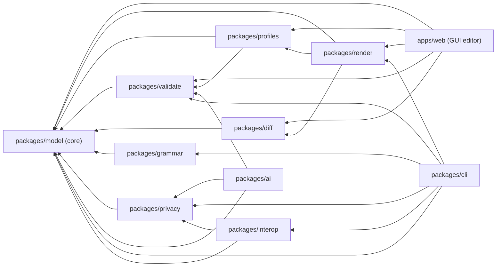

# SDD harness — Spec-Driven Development + impact analysis

This directory is the **Spec-Driven Development (SDD) harness** for PsyUML. It keeps
the implementation honest to the specification and makes **change-impact analysis**
cheap: for any file or directory you can see what it depends on, what depends on it,
and which spec section it serves.

> **Why "harness"?** Beyond documents, this includes an executable checker
> (`check.mjs`) that *enforces* the discipline in CI. It also serves as the project's
> living design documentation (the "Software Design Document" reading) — the
> per-directory `IMPACT.md` files and the dependency map below are that design record.

## The SDD loop

```
PsyUML spec (§A–§L)  ──►  Requirement (REQ-…)  ──►  Milestone (M0–M10)  ──►  Implementation  ──►  Verification
  source of truth          traceability.json         ROADMAP.md             packages/… apps/…      tests + check.mjs
```

- **Spec is the source of truth** (`../docs/specification/psyuml-v0.1.0.md`). Code changes that alter behavior must trace back to a spec section (or first amend the spec via the §K versioning rules).
- **`traceability.json`** is the registry linking each `REQ-…` to its spec sections, milestone, status, and the impl/test paths that satisfy it. `check.mjs` validates it.
- **`ROADMAP.md`** sequences the milestones; **`ARCHITECTURE.md`** defines the modules.

## Impact-analysis convention (per file & directory)

**Every tracked directory carries an `IMPACT.md`** (use `templates/impact.md`). It documents:

- **Purpose / status** of the directory.
- **Upstream** — what it depends on (changing those can break *this*).
- **Downstream** — what depends on it (changing *this* can break those). This is the blast radius.
- **Files table** — one row per file: purpose · upstream · downstream · spec/REQ ref · change risk.
- **Change checklist** — what to re-check and re-run before merging a change here.

"Tracked" = every directory except dot-directories (`.git`, `.github`, …) and
build/vendor dirs (`node_modules`, `dist`, …). The checker requires an `IMPACT.md`
in each tracked directory and that **every file is mentioned** in it.

**Bulk coverage for generated/fixture files.** A directory whose files are generated or
are many similar fixtures can declare glob coverage instead of a row per file:

```
<!-- sdd:cover: *.svg, *.psyuml -->
```

Any file matching a covered glob counts as documented (e.g. `examples/` covers its
`*.psyuml` fixtures + generated `*.svg` goldens). Use this only for generated artifacts or
homogeneous fixtures — **source files should still be enumerated** so their blast radius is
captured. Globs support `*.ext` (suffix), `prefix*` (prefix), and exact names.

## System-level impact map (module dependency DAG)

From `../docs/ARCHITECTURE.md` §10. An arrow `A ──► B` means **A depends on B**, so a
change in **B** can ripple **up the arrows** into A.



> **`packages/interop`** (lossy, export-only FHIR R4, REQ-INTEROP-FHIR, M15) is now in the repo —
> an **isolated leaf**: nothing depends on it but the optional `psyuml export` CLI subcommand, so
> removing it leaves everything else working. It reuses `@psyuml/privacy` for de-identification.

**Reverse-dependency (blast radius) quick reference:**

| If you change… | Re-check / re-test… |
|---|---|
| `packages/model` (core metamodel) | **everything** — validate, profiles, render, diff, grammar, privacy, ai, cli, apps/web, conformance |
| `packages/validate` | profiles, apps/web, CI lint of `examples/` |
| `packages/profiles` | render, apps/web, translation-table consumers |
| `packages/render` | apps/web, golden-SVG snapshots |
| `packages/diff` | apps/web Compare panel (model only; pure) |
| `packages/grammar` | CLI, round-trip tests (model only) |
| `packages/privacy` | CLI `redact`, AI-assist (M8), interop export (model only) |
| `packages/cli` | the `psyuml` binary (bundled); no in-repo importers |
| `packages/interop` | `psyuml export` (CLI) only — an isolated leaf; lossy, export-only FHIR R4, de-identified by default |
| `packages/ai` | isolated guardrail lib; no in-repo importer yet (safe to remove) |
| `docs/specification/psyuml-v0.1.0.md` | `traceability.json`, any REQ citing the changed section, dependent IMPACT docs |

`model` is the highest-blast-radius module by design (everything depends on it and it
depends on nothing). Keep it small, stable, and UI/vendor-free.

## Running the checker

```
node sdd/check.mjs
```

It exits non-zero (and lists every violation) if a directory is missing its
`IMPACT.md`, a file is undocumented, or `traceability.json` is malformed or points at
missing sources. It runs in CI on every push/PR (`.github/workflows/ci.yml`, the `sdd`
job) and is also wired as `pnpm run sdd:check` (part of `pnpm run verify`).

## Workflows

**Add a requirement:** add an entry to `traceability.json` (`REQ-…`, spec refs,
milestone, `status: planned`, planned impl/test globs). Optionally write a feature
spec from `templates/feature-spec.md`.

**Add a file:** add a row to its directory's `IMPACT.md` (purpose, upstream,
downstream, spec/REQ, change risk) — the checker fails until you do.

**Add a directory:** copy `templates/impact.md` to `<dir>/IMPACT.md` and fill it in.

**Change a module:** consult the reverse-dependency table above and the module's
`IMPACT.md`, update downstream dependents, then run `node sdd/check.mjs`.

**Change behavior:** update the spec section first (or in the same change), bump the
relevant `REQ-…`, and keep `status`/`impl`/`tests` current.

## Contents

| Path | What it is |
|---|---|
| `README.md` | This file — the harness overview. |
| `traceability.json` | Spec ↔ requirement ↔ milestone ↔ impl/test registry (machine-checked). |
| `check.mjs` | Zero-dependency checker enforcing the impact-doc + traceability rules. |
| `templates/` | Reusable templates (`impact.md`, `adr.md`, `feature-spec.md`). |
| `adr/` | Architecture Decision Records. |
